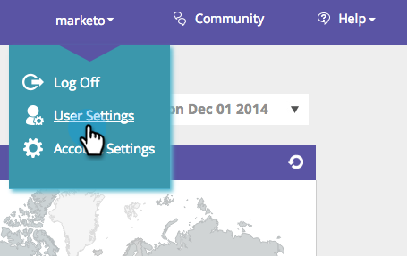

# [!UICONTROL Editar Regiões] {#edit-regions}

Deseja alterar as configurações regionais do usuário para ver apenas os dados da sua região específica?

1. Vá para **[!UICONTROL Configurações de Usuário]**.

   

1. Clique em **[!UICONTROL Editar Regiões]**.

   

1. Verifique seus países ou estados relacionados à sua região.

>[!NOTE]
>
>Selecionar os Estados Unidos abrirá na parte inferior da página todas as opções de Estados dos EUA para seleção.
