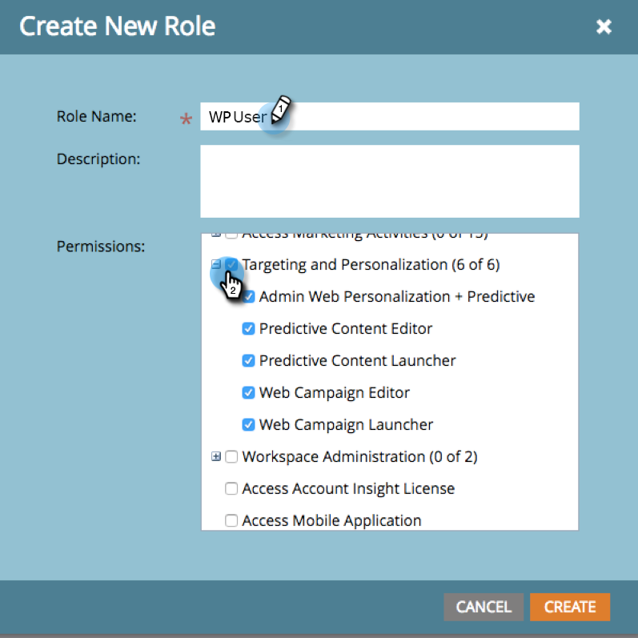
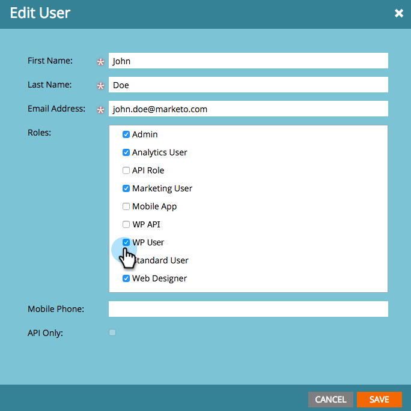

# Gerenciamento de logon e usuários {#login-and-user-management}

## Criar uma Função de Usuário do [!UICONTROL Web Personalization] {#create-a-web-personalization-user-role}

1. Vá para a seção **[!UICONTROL Administrador]** e clique em **[!UICONTROL Usuários e funções]**.

   

1. Clique em **[!UICONTROL Funções]**.

   

   >[!NOTE]
   >
   >Se a função de usuário do Web Personalization (WP) já existir, verifique se ela está configurada conforme mostrado na Etapa 4.

1. Clique em **[!UICONTROL Nova Função]**.

   

1. Insira um [!UICONTROL Nome da Função] e selecione [!UICONTROL Permissões]. Clique em **[!UICONTROL Criar]** (esta função deve [se aplicar a todos os espaços de trabalho](/help/marketo/product-docs/administration/users-and-roles/managing-marketo-users.md)).

   

   >[!TIP]
   >
   >Para conceder aos usuários permissão para acessar tudo no Targeting e no Personalization, marque _todas_ as caixas de seleção.

## [!UICONTROL Web Personalization] e permissões de usuário de conteúdo preditivo {#web-personalization-and-predictive-content-user-permissions}

**[!UICONTROL Direcionamento e Personalization]**: o usuário tem permissões somente para exibição, caso essa permissão esteja selecionada.

**[!UICONTROL Web Personalization do Administrador + Predictive]**: o usuário tem acesso somente às Configurações de Conta e às Configurações de Conteúdo para o aplicativo Web Personalization e Predictive Content. Os usuários podem visualizar páginas no aplicativo, mas não têm permissões para criar, editar, excluir, iniciar.

**[!UICONTROL Editor de Conteúdo Preditivo]**: o usuário tem acesso de editor ao aplicativo de Conteúdo Preditivo. A permissão permite criar, editar e excluir partes de conteúdo. Ele não permite ativar o conteúdo para uso preditivo na Web ou por email.

**[!UICONTROL Iniciador de Conteúdo Preditivo]**: o usuário tem acesso a todos os recursos de Conteúdo Preditivo, exceto Configurações de Conta e Conteúdo. A permissão permite criar, editar e excluir e ativar partes de conteúdo.

**[!UICONTROL Editor do Web Campaign]**: o usuário tem acesso de editor a todos os recursos do Web Personalization para criar, editar e excluir, mas não para iniciar campanhas da Web.

**[!UICONTROL Iniciador do Web Campaign]**: o usuário tem acesso a todos os recursos do aplicativo Web Personalization, exceto Configurações de Conta e Conteúdo. A permissão permite criar, editar, excluir e iniciar campanhas da Web.

## Atribuir Função WP ao Usuário {#assign-wp-role-to-user}

1. Vá para **[!UICONTROL Usuários]**.

   

1. Selecione o usuário ao qual conceder acesso de WP e clique em **[!UICONTROL Editar Usuário]**.

   

1. Selecione a função de usuário WP para todos os espaços de trabalho.

   

1. Usuários recém-habilitados verão o bloco **[!UICONTROL Web Personalization]** em My Marketo na próxima vez que fizerem logon.

   
