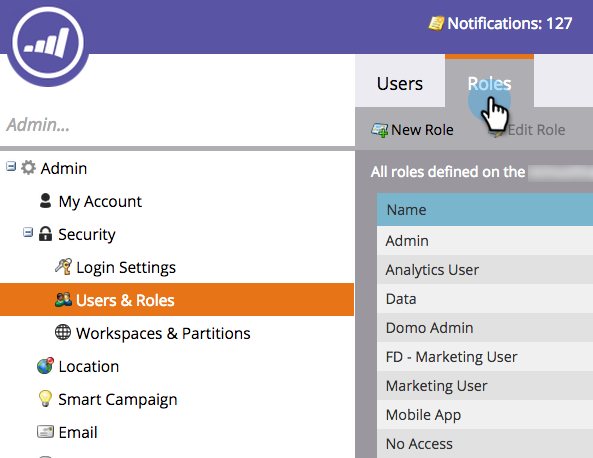

# Logon e gerenciamento de usuários {#login-and-user-management}

## Criar uma função de usuário de personalização da Web {#create-a-web-personalization-user-role}

1. Vá para a seção **Admin** e clique em **Usuários e funções**.

   

1. Clique em **Funções**.

   

   >[!NOTE]
   >
   >Se a função de usuário Personalização da Web (WP) já existir, verifique se ela está configurada como mostrado na Etapa 4.

1. Clique em **Nova função**.

   

1. Insira um Nome de função e selecione Permissões. Clique em **Criar** (essa função deve [se aplicar a todos os espaços de trabalho](http://docs.marketo.com/display/DOCS/Managing+Marketo+Users#ManagingMarketoUsers-CreateUsers)).

   

   >[!TIP]
   >
   >Para conceder aos usuários permissão para acessar tudo em Definição de metas e personalização, marque *todas* as caixas de seleção.

## Personalização da Web e permissões de usuário de conteúdo preditivo {#web-personalization-and-predictive-content-user-permissions}

**Definição de metas e personalização**: O usuário só tem permissões de visualização, se essa permissão estiver selecionada.

**Personalização da Web do administrador + preditivo**: O usuário tem acesso somente às Configurações da conta e às Configurações de conteúdo para o aplicativo Personalização da Web e Conteúdo previsível. Os usuários podem visualização páginas no aplicativo, mas não têm permissões para criar, editar, excluir e iniciar.

**Editor** de conteúdo preditivo: O usuário tem acesso de editor ao aplicativo Conteúdo previsível. A permissão permite criar, editar e excluir partes de conteúdo. Ela não permite ativar o conteúdo para uso preditivo na Web ou no email.

**Iniciador** de conteúdo preditivo: O usuário tem acesso a todos os recursos de Conteúdo previsível, exceto Configurações de conta e conteúdo. A permissão permite criar, editar, excluir e ativar partes de conteúdo.

**Editor** de Campanhas da Web: O usuário tem acesso de editor a todos os recursos de Personalização da Web para criar, editar e excluir, mas não iniciar campanhas da Web.

**Iniciador de Campanhas** da Web: O usuário tem acesso a todos os recursos do aplicativo de Personalização da Web, exceto Configurações de conta e conteúdo. A permissão permite criar, editar, excluir e iniciar campanhas da Web.

## Atribuir função WP ao usuário {#assign-wp-role-to-user}

1. Vá para **Usuários**.

   

1. Selecione o usuário ao qual conceder acesso ao WP e clique em **Editar usuário**.

   

1. Selecione a função de usuário WP para todos os espaços de trabalho.

   

1. Os usuários recém-habilitados verão o mosaico Personalização **** da Web em Meu mercado para a próxima vez que fizerem logon.

   
