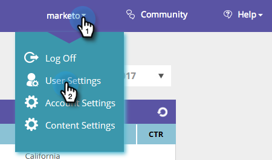
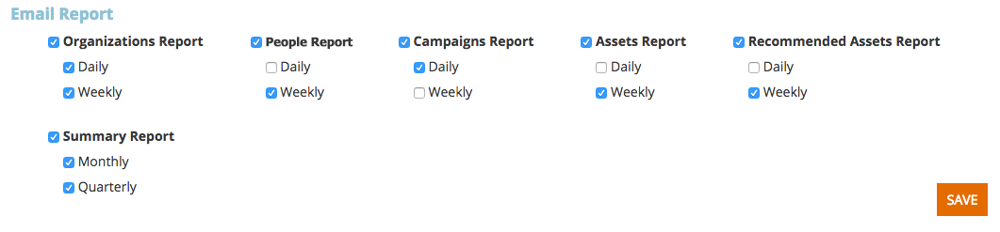

# [!UICONTROL Configurações de usuário] {#user-settings}

Altere configurações como fuso horário ou relatórios de email do Web Personalization.

## Perfil do usuário / Senhas / Fusos horários {#user-profile-passwords-time-zones}

1. Clique no seu nome e selecione **[!UICONTROL Configurações de Usuário]**.

   

1. A página [!UICONTROL Configurações de Usuário] é exibida.

   

   Na página [!UICONTROL Configurações de Usuário], é possível:

   * Alterar seu endereço de email
   * Adicionar detalhes pessoais (nome e sobrenome, número de celular e fuso horário)
   * Selecione o número de linhas que deseja exportar ao exportar tabelas na plataforma. Consulte o campo: &quot;Número máximo de linhas na exportação do Excel (limitado a 10.000)&quot;
   * Selecione sua [!UICONTROL Notificação Móvel] para uma nova pessoa ou lista de observação relacionada ao aplicativo móvel
   * Ajuste as configurações de Região pessoal clicando em **[!UICONTROL Editar Regiões]**.
   * Alterar sua senha
   * Selecione as configurações de notificação do Relatório de email para relatórios de email sobre organizações, pessoas, campanha e desempenho do ativo

   Clique em **[!UICONTROL Salvar]** depois de fazer as alterações.

   >[!NOTE]
   >
   >Selecionar sua região exibirá apenas dados e enviará relatórios de email relacionados a organizações e pessoas da região definida.

## Selecionar relatórios de e-mail {#select-email-reports}

Selecione qual [[!UICONTROL Relatório de email]](/help/marketo/product-docs/web-personalization/reporting-for-web-personalization/email-reports.md) deve ser associado ao seu usuário e a frequência ([!UICONTROL Diariamente], [!UICONTROL Semanalmente] ou [!UICONTROL Trimestralmente]) em que o relatório será enviado.

>[!NOTE]
>
>Clicar em **[!UICONTROL Salvar]** não sairá de Configurações do Usuário. Para sair, clique no logotipo do Marketo no canto superior esquerdo e selecione seu destino.

>[!MORELIKETHIS]
>
>[Editar Regiões](/help/marketo/product-docs/web-personalization/getting-started/edit-regions.md)
