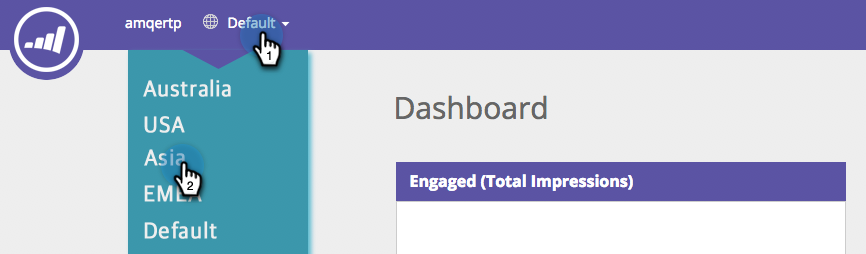
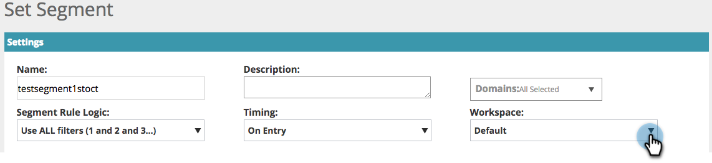

# Espaços de trabalho em [!UICONTROL Web Personalization] {#workspaces-in-web-personalization}

O [!UICONTROL Web Personalization] oferece suporte a vários espaços de trabalho para campanhas da Web e segmentos da Web.

## Alternar espaços de trabalho {#switch-workspaces}

Para alternar entre espaços de trabalho na personalização da Web, clique no ícone de globo na parte superior esquerda e escolha um espaço de trabalho diferente no menu suspenso.

## Alterar o Workspace de um segmento {#change-a-segments-workspace}

1. Vá para a página **[!UICONTROL Segmentos]**, selecione um segmento e clique no ícone de edição.

   

1. Selecione um espaço de trabalho diferente no menu suspenso **[!UICONTROL Workspace]**.

   

   

>[!NOTE]
>
>Os usuários só poderão ver campanhas da Web e segmentos associados aos espaços de trabalho aos quais têm acesso. Veja como [conceder a um usuário acesso a um ou mais espaços de trabalho](/help/marketo/product-docs/administration/workspaces-and-person-partitions/allow-user-access-to-a-workspace.md).
