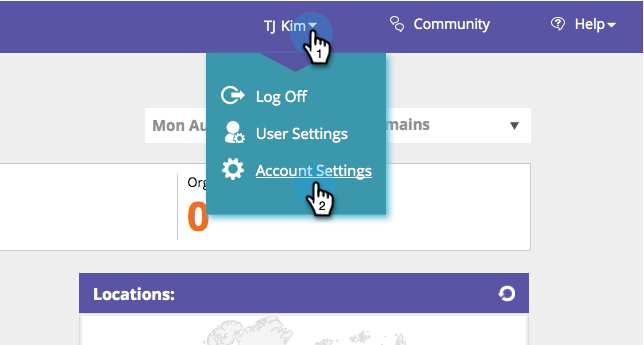

# Excluir IPs específicos do rastreamento {#exclude-specific-ips-from-being-tracked}

Você já quis excluir seus próprios funcionários e o nome da organização do rastreamento e dos relatórios no Web Personalization?

Você pode excluir IPs individuais e todos ou parte de um intervalo de IPs.

>[!NOTE]
>
>Esse processo pode levar até cinco minutos para ser concluído.

1. Faça logon no Web Personalization e, em seu logon, clique em **Configurações da conta**.

   

1. Role para baixo até a área **IP exclude**. Se você estiver excluindo endereços IP pela primeira vez, clique no campo vazio **Excluir endereços IP**.

   

1. Insira o(s) IP(s) individual(is) ou os intervalos de IPs que deseja excluir do rastreamento e dos relatórios e clique em **Salvar**.

   

   >[!NOTE]
   >
   >Você pode excluir um único endereço IPv4 ou IPv6, ou um intervalo completo, semirintervalo ou por máscara de sub-rede. Os itens no exemplo acima mostram um de cada, com base nos exemplos fornecidos no próprio formulário do Marketo.

1. O campo Excluir endereços IP agora lista os endereços IP inseridos. Para editar as exclusões de IP, clique no sinal de mais verde para reabrir o formulário.

   

   Você viu como aquilo era fácil? Agora é possível excluir todos os dados dos IPs adicionados, individualmente ou por intervalo.
