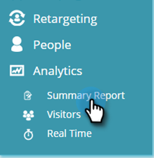
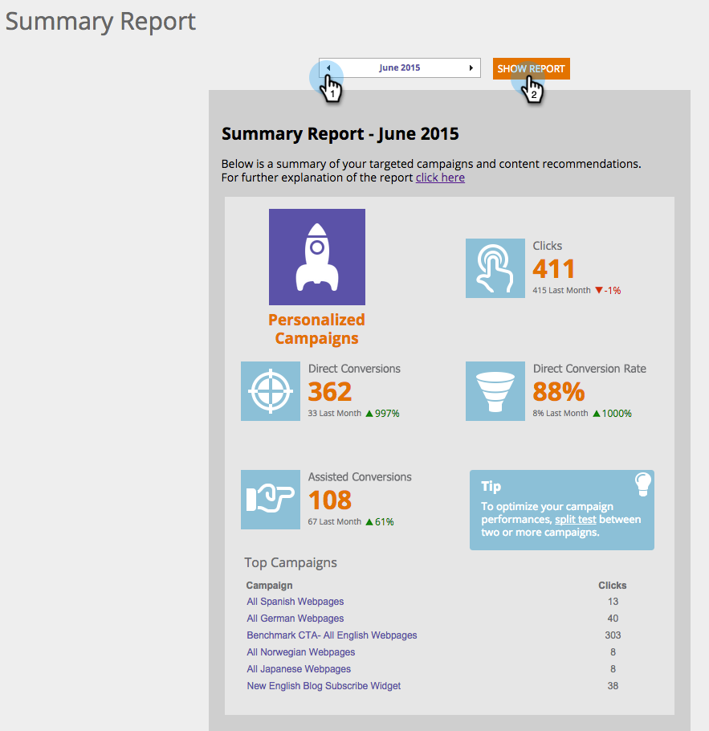

# Entendendo o [!UICONTROL Relatório de resumo] {#understanding-the-summary-report}

O [!UICONTROL Relatório de resumo] é uma exibição mensal de todas as campanhas e do desempenho de conteúdo recomendado. É baseado no número de cliques e no número de leads (diretos ou assistidos) que interagiram com a campanha personalizada ou o conteúdo recomendado e, em seguida, se tornaram um lead conhecido. O relatório compara os resultados do mês anterior.

>[!NOTE]
>
>**Definição**
>
>Conversão direta: um visitante da Web que clica em uma campanha personalizada ou ativo de conteúdo recomendado e na mesma sessão de visita continua a preencher qualquer formulário no site com seu endereço de email.
>
>Conversão assistida: um visitante da Web que preenche qualquer formulário do site e deixa o endereço de email, que em uma visita anterior (nos últimos 6 meses) clicou em uma campanha personalizada ou ativo de conteúdo recomendado.

No [!UICONTROL Web Personalization], vá para o **[!UICONTROL Analytics]** e o **[!UICONTROL Relatório de Resumo]**.

Selecione **Mês** e clique em **[!UICONTROL Mostrar Relatório]**.

A primeira parte do relatório está relacionada às campanhas e exibições personalizadas do Web Personalization:

* **[!UICONTROL Cliques]** - todos os cliques nas campanhas do Web Personalization
* **[!UICONTROL Conversões diretas]** - todos os visitantes que clicaram em uma campanha do Web Personalization durante a visita e preencheram um formulário
* **[!UICONTROL Taxa de conversão direta]** - a porcentagem de visitantes que se tornaram clientes em potencial diretos depois de clicar em uma campanha do Web Personalization. Cliques em potencial diretos divididos por cliques
* **[!UICONTROL Conversões assistidas]** - todos os visitantes que preencheram um formulário e clicaram em uma campanha do Web Personalization em uma visita anterior (nos últimos 6 meses)
* **[!UICONTROL Dica]** - dicas para otimizar os desempenhos de campanha do Web Personalization
* **[!UICONTROL Campanhas mais populares]** - as campanhas com melhor desempenho durante o período selecionado, ordenadas por número de cliques

A segunda parte do relatório está relacionada ao Conteúdo recomendado do mecanismo de recomendação de conteúdo do Web Personalization. Ele exibe:

* **[!UICONTROL Cliques]** - todos os cliques no conteúdo recomendado do Web Personalization
* **[!UICONTROL Conversões diretas]** - todos os visitantes que clicaram no conteúdo recomendado durante a visita e preencheram um formulário
* **[!UICONTROL Taxa de conversão direta]** - a porcentagem de visitantes que se tornaram clientes em potencial diretos depois de clicar no conteúdo recomendado. Cliques em potencial diretos divididos por cliques
* **[!UICONTROL Conversões assistidas]** - todos os visitantes que preencheram um formulário e clicaram no conteúdo recomendado em uma visita anterior (nos últimos 6 meses)
* **[!UICONTROL Dica]** - dicas para otimizar usando o Mecanismo de Recomendação de Conteúdo
* **[!UICONTROL Principais Recomendações]** - o conteúdo recomendado com melhor desempenho durante o período selecionado, ordenado pelo número de cliques

>[!NOTE]
>
>O Marketo Web Personalization captura o endereço de email do visitante da Web para qualquer formulário concluído no site. Exibido na página de clientes potenciais do Web Personalization, é o cliente potencial usado no relatório de Resumo.
