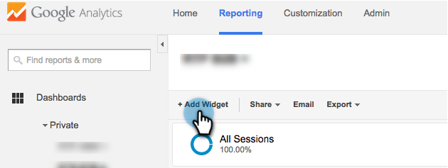
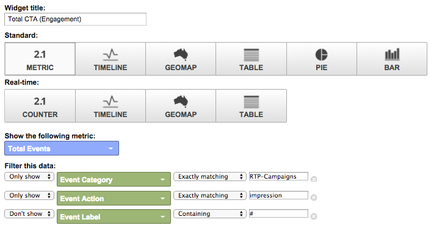

# Painéis RTP personalizados no Google Universal Analytics {#custom-rtp-dashboards-in-google-universal-analytics}

>[!PREREQUISITES]
>
>[Integrar RTP com o Google Universal Analytics](/help/marketo/product-docs/web-personalization/reporting-for-web-personalization/web-analytics-integrations/integrate-rtp-with-google-universal-analytics.md)

Esta publicação explica como configurar painéis RTP no Google Universal Analytics (GUA). Os dados enviados do RTP para o GUA podem ser configurados como dois painéis personalizados separados chamados:

* RTP B2B
* Envolvimento com RTP

## Configurar um painel personalizado {#setting-up-a-custom-dashboard}

1. Faça logon no Google Analytics. Clique em **[!UICONTROL Relatórios]** no menu superior. Clique em **[!UICONTROL Painéis]** e **[!UICONTROL Novo Painel]**.

   

1. Selecione **Tela em Branco**, adicione um **Nome do Painel** e clique em **[!UICONTROL Criar Painel]**.

1. Clique em **[!UICONTROL Adicionar widget]** para criar um novo widget.

   

## Painel B2B RTP {#rtp-b-b-dashboard}

Esse painel permite que os usuários analisem o desempenho do site a partir de uma perspectiva B2B.

Ela fornece informações como origem de visitas e comportamento no local por setor, receita, tamanho, listas baseadas em conta e segmentos de destino.

O painel consiste em 3 colunas

* Traffic source
* Segmentação
* Perfuração firme

1. Crie um novo painel chamado **Painel B2B RTP** e defina os seguintes widgets:

<table> 
 <thead> 
  <tr> 
   <th> 
    

      Coluna 1 - Fontes de tráfego
    
</th> 
   <th> 
    
 <strong>Coluna 2 - Segmentação</strong> 
    
</th> 
   <th> 
    
 <strong>Coluna 3 - Detalhamento Firmográfico</strong> 
    
</th> 
  </tr> 
 </thead> 
 <tbody> 
  <tr> 
   <td> 
    <ul> 
     <li>Nome: Sessões por segmentos e canais</li> 
     <li>Tipo de widget: Barra </li> 
     <li>Criar um gráfico de barras que mostre: Sessão</li> 
     <li>Agrupado por: Rótulo de evento</li> 
     <li>Deslocar por: Agrupamento de Canais Padrão</li> 
     <li>Filtro:  Somente Mostrar | Categoria de Eventos (contendo) RTP-Segmentos</li> 
    </ul>

</td> 
   <td> 
    <ul> 
     <li>Nome: nº de usuários segmentados RTP</li> 
     <li>Tipo: 2.1 Métrica</li> 
     <li>Mostrar a seguinte métrica: Usuários </li> 
     <li>Filtro:  Somente Mostrar | Categoria de eventos (contendo) segmentos RTP</li> 
    </ul>

</td> 
   <td> 
    <ul> 
     <li>Nome: Sessões por setor</li> 
     <li>Tipo: Pizza </li> 
     <li>Criar um gráfico de pizza mostrando: Sessões</li> 
     <li>Agrupado por: RTP-Indústria</li> 
    </ul>

</td> 
  </tr> 
  <tr> 
   <th> 
    <ul> 
     <li><strong>Nome: Sessões por setor e canais</strong></li> 
     <li><strong>Tipo de widget: Barra</strong></li> 
     <li><strong>Criar um gráfico de barras que mostre: Sessão</strong></li> 
     <li><strong>Agrupado por: RTP-Indústria</strong></li> 
     <li><strong>Deslocar por: Agrupamento de Canais Padrão</strong> </li> 
    </ul></th> 
   <th> 
    <ul> 
     <li><strong>Nome: Sessões segmentadas por país</strong></li> 
     <li><strong>Tipo: Geomap</strong></li> 
     <li><strong>Plotar métrica selecionada: País | Sessões</strong></li> 
     <li><strong>Selecione uma região: O Mundo</strong></li> 
     <li><strong>Filtro: Somente Mostrar | Categoria de eventos (contendo) segmentos RTP</strong></li> 
    </ul>

</th> 
   <th> 
    <ul> 
     <li><strong>Nome: Sessões por Categoria RTP</strong></li> 
     <li><strong>Tipo: Pizza</strong></li> 
     <li><strong>Criar um gráfico de pizza mostrando: Sessões</strong></li> 
     <li><strong>Agrupado por: Categoria-RTP</strong></li> 
    </ul>

</th> 
  </tr> 
  <tr> 
   <th> </th> 
   <th> 
    <ul> 
     <li>Nome: Principais Segmentos do Target</li> 
     <li>Tipo: Barra</li> 
     <li>Criar um gráfico de barras que mostre: Usuários</li> 
     <li>Agrupado por: Ação de Evento</li> 
     <li>Filtro: Somente Mostrar | Categoria de eventos (contendo) segmentos RTP</li> 
    </ul>

</th> 
   <th> 
    <ul> 
     <li>Nome: Sessões por Grupos RTP</li> 
     <li>Tipo: Barra </li> 
     <li>Criar um gráfico de barras que mostra: Sessões</li> 
     <li>Agrupado por: RTP-Group</li> 
    </ul>

</th> 
  </tr> 
  <tr> 
   <th> </th> 
   <th> 
    <ul> 
     <li>Nome: Sessões e Metas por Segmentos Principais</li> 
     <li>Tipo: Tabela </li> 
     <li>Exibir as seguintes colunas:  Rótulo de Evento | Sessões | Índice de conversão de meta</li> 
     <li>Filtro:  Mostrar apenas | Categoria de evento (contendo) Segmentos RTP</li> 
    </ul>

</th> 
   <th> </th> 
  </tr> 
 </tbody> 
</table>

## Painel de Envolvimento RTP {#rtp-engagement-dashboard}

Esse painel permite que os usuários analisem o desempenho da campanha RTP e os engajamentos do mecanismo de recomendação. Ela fornece a comparação da média duração da sessão e páginas por sessão entre:

* Não engajado
* Engajado (impressões e cliques em uma campanha personalizada)
* Cliques no Mecanismo de recomendação e principais conteúdos recomendados

Crie um novo painel chamado **Painel de Envolvimento RTP** e defina os seguintes widgets:

<table> 
 <thead> 
  <tr> 
   <th> 
    
 <strong>Coluna 1 - Exposição de Campanhas</strong> 
    
</th> 
   <th> 
    
 <strong>Clickthrough de Campanhas da Coluna 2</strong> 
    
</th> 
   <th> 
    
 <strong>Mecanismo de Recomendação da Coluna 3</strong> 
    
</th> 
  </tr> 
 </thead> 
 <tbody> 
  <tr> 
   <td> 
    <ul> 
     <li>Nome: <strong>Total de CTA (Envolvimento)</strong></li> 
     <li>Tipo: <strong>2.1 Métrica </strong></li> 
     <li>Mostrar a seguinte métrica: <strong>Total de eventos</strong></li> 
     <li>Filtros: <strong>[mostrar apenas] Categoria de Evento (contém): RTP-Campanhas</strong> <strong>[mostrar apenas] Ação de Evento (exatamente correspondente): Impressão</strong>[não mostrar] Rótulo de Evento (contendo): #</li> 
    </ul>

</td> 
   <td> 
    <ul> 
     <li>Nome: <strong>Total de CTA (ClickThrough)</strong></li> 
     <li>Tipo: <strong>2.1 Métrica </strong></li> 
     <li>Mostrar a seguinte métrica: <strong>Total de eventos</strong></li> 
     <li>Filtros: <strong>[mostrar apenas] Categoria de Evento (contém): RTP-Campanhas</strong> <strong>[mostrar apenas] Ação de Evento (correspondência exata): Cliques</strong><strong>[não mostrar] Rótulo de Evento (contendo): #</strong></li> 
    </ul>

</td> 
   <td> 
    <ul> 
     <li>Nome: <strong>CRE - Total de Cliques</strong></li> 
     <li>Tipo: <strong>2.1 Métrica</strong> </li> 
     <li>Mostrar a seguinte métrica: <strong>Pageviews</strong></li> 
     <li>Filtro: <strong>[mostrar somente] Página (contendo): rcmd</strong></li> 
    </ul>

</td> 
  </tr> 
  <tr> 
   <td colspan="1"> 
    <ul> 
     <li>Nome: <strong>Média Duração da Sessão (Envolvimento)</strong></li> 
     <li>Tipo: <strong>2.1 Métrica </strong></li> 
     <li>Mostrar a seguinte métrica: <strong>Média Duração da sessão</strong></li> 
     <li>Filtros: <strong>[mostrar apenas] Categoria de evento (correspondência exata): RTP-Campanhas</strong> <strong>[mostrar apenas] Ação de evento (correspondência exata): impressão</strong><strong>[não mostrar] Rótulo de evento (contendo): #</strong></li> 
    </ul>

</td> 
   <td colspan="1"> 
    <ul> 
     <li>Nome: <strong>Média Duração da Sessão (Clickthrough)</strong></li> 
     <li>Tipo: <strong>2.1 Métrica </strong></li> 
     <li>Mostrar a seguinte métrica: <strong>Média Duração da sessão</strong></li> 
     <li>Filtros: <strong>[mostrar apenas] Categoria de evento (correspondência exata): RTP-Campanhas</strong> <strong>[mostrar apenas] Ação de evento (correspondência exata): cliques</strong><strong>[não mostrar] Rótulo de evento (contendo): #</strong></li> 
    </ul>

</td> 
   <td colspan="1"> 
    <ul> 
     <li>Nome: <strong>CRE - Principal Conteúdo Recomendado</strong></li> 
     <li>Tipo: <strong>Tabela</strong> </li> 
     <li>Exibir as seguintes colunas:  <strong>Título da Página | Exibições de página</strong> </li> 
     <li>Filtros: Filtro: <strong>[mostrar somente] Página (contendo): rcmd</strong></li> 
    </ul>

</td> 
  </tr> 
  <tr> 
   <td> 
    <ul> 
     <li>Nome: <strong>Páginas/Sessão (Envolvimento)</strong></li> 
     <li>Tipo: <strong>2.1 Métrica </strong></li> 
     <li>Mostrar a seguinte métrica: <strong>Páginas/Sessão</strong></li> 
     <li>Filtros: <strong>[mostrar somente] Categoria de Eventos (correspondência exata): RTP-Campanhas</strong></li> 
     <li><strong>[mostrar somente] Ação de Evento (correspondência exata): impressão</strong></li> 
     <li><strong>[não mostrar] Rótulo de Evento (contendo): #</strong></li> 
    </ul>

</td> 
   <td> 
    <ul> 
     <li>Nome: <strong>Páginas/Sessão (Click-through)</strong></li> 
     <li>Tipo: <strong>2.1 Métrica </strong></li> 
     <li>Mostrar a seguinte métrica: <strong>Páginas/Sessão</strong></li> 
     <li>Filtros: <strong>[mostrar apenas] Categoria de Evento (correspondência exata): RTP-Campanhas</strong></li> 
     <li><strong>[mostrar apenas] Ação do evento (correspondência exata): cliques</strong></li> 
     <li><strong>[não mostrar] Rótulo de evento (contendo): #</strong></li> 
    </ul>

</td> 
   <td> </td> 
  </tr> 
  <tr> 
   <td> 
    <ul> 
     <li>Nome: <strong>Impressões por CTA</strong></li> 
     <li>Tipo: <strong>Tabela</strong></li> 
     <li>Exibir as seguintes colunas: <strong>Rótulo do Evento | Total de eventos | Usuários</strong></li> 
     <li>Filtros: <strong>[mostrar somente] Categoria de eventos (exatamente correspondentes): RTP-Campanhas</strong> <strong>[mostrar somente] Ação de eventos (exatamente correspondentes): impressão</strong><strong>[não mostrar] Rótulo de Eventos (contendo): #</strong></li> 
    </ul>

</td> 
   <td> 
    <ul> 
     <li>Nome: <strong>Clickthrough de CTA</strong></li> 
     <li>Tipo: <strong>Tabela</strong></li> 
     <li>Exibir as seguintes colunas: <strong>Rótulo do Evento | Total de eventos | Usuários</strong></li> 
     <li>Filtros: <strong>[mostrar somente] Categoria de Evento (exatamente correspondentes): RTP-Campanhas</strong> <strong>[mostrar somente] Ação de Evento (exatamente correspondentes): cliques</strong></li> 
    </ul>

</td> 
   <td> </td> 
  </tr> 
 </tbody> 
</table>

>[!MORELIKETHIS]
>
>[Integrar RTP com o Google Universal Analytics](/help/marketo/product-docs/web-personalization/reporting-for-web-personalization/web-analytics-integrations/custom-rtp-reports-in-google-universal-analytics.md)
>
>[Relatórios RTP personalizados no Google Universal Analytics](/help/marketo/product-docs/web-personalization/reporting-for-web-personalization/web-analytics-integrations/custom-rtp-reports-in-google-universal-analytics.md)
