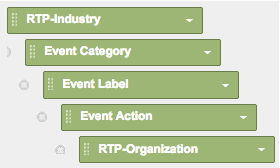

# Relatórios RTP personalizados no Google Universal Analytics {#custom-rtp-reports-in-google-universal-analytics}

>[!PREREQUISITES]
>
>[Integrar RTP ao Google Universal Analytics](integrate-rtp-with-google-universal-analytics.md)

Esta publicação explica como configurar relatórios personalizados RTP para o Google Universal Analytics (GUA).  Os dados enviados de RTP para GUA podem ser configurados como dois relatórios personalizados separados chamados:

* RTP B2B
* Participação no RTP

## Configuração de um Relatório Personalizado {#setting-up-a-custom-report}

1. Efetue login em Google Analytics.
1. Clique em **Personalização **no menu superior.
1. Clique em **+Novo Relatório Personalizado.**

** 

**

## Relatório RTP B2B {#rtp-b-b-report}

1. Nomeie o relatório **Relatório RTP B2B**.
1. Nomear a 1ª guia **Indústria **

   1. (Observação: você **Duplicado essa guia** e cria outros semelhantes - etapa 5)

1. Selecione o tipo de relatório** Explorer**.\
   ** 

   **

1. Na seção **Grupos de métricas**, selecione as métricas relevantes para seu negócio.

   1. Recomendamos o seguinte:\
      ** 

      **

1. Duplicado esta guia 4 vezes e nomeie-as:

   1. **Indústria**
   1. **Grupo**
   1. **Categoria**
   1. **ABM**
   1. **Organizações**

   

1. Na seção **Detalhamentos do Dimension** defina as dimensões relevantes para cada guia, como abaixo.

<table> 
 <thead> 
  <tr> 
   <th> 
    

      Nome da guia 
    
</th> 
   <th> 
    

      Detalhamentos do Dimension 
    
</th> 
  </tr> 
 </thead> 
 <tbody> 
  <tr> 
   <td>Indústria</td> 
   <td></td> 
  </tr> 
  <tr> 
   <td>Grupo</td> 
   <td></td> 
  </tr> 
  <tr> 
   <td>Categoria</td> 
   <td></td> 
  </tr> 
  <tr> 
   <td>ABM</td> 
   <td></td> 
  </tr> 
  <tr> 
   <td>Organizações</td> 
   <td></td> 
  </tr> 
 </tbody> 
</table>

1. Não defina nenhum filtros e defina este relatório como disponível para **Todos os dados do site da Web **(ou altere se relevante para uma conta específica do Analytics).
1. Clique em **Salvar**.\
   

## Relatório de envolvimento RTP {#rtp-engagement-report}

1. Nomeie o relatório **Relatório de Envolvimento RTP.**
1. Defina o nome da primeira guia como **Todo o envolvimento**

   1. (Observação: você vai Duplicado essa guia e criar outras semelhantes - etapa 5)

1. Selecione o tipo de relatório **Explorer**.\
   

1. Na seção Grupos de métricas, selecione as métricas relevantes para seu negócio. Esta é uma recomendação:\
   

1. Duplicado esta guia 4 vezes e nomeie-as:

   1. **Todos os envolvimentos**
   1. **Envolvimento por setor**
   1. **Participação por grupo**
   1. **Participação por Categoria**
   1. **Participação por ABM**

   ** \**

1. Na seção **Detalhamentos do Dimension** defina as dimensões relevantes para cada guia, como a seguir:

<table> 
 <thead> 
  <tr> 
   <th> 
    

      Nome da guia 
    
</th> 
   <th> 
    

      Detalhamentos do Dimension 
    
</th> 
  </tr> 
 </thead> 
 <tbody> 
  <tr> 
   <td>Todos os envolvimentos</td> 
   <td></td> 
  </tr> 
  <tr> 
   <td>Participação por ABM</td> 
   <td></td> 
  </tr> 
  <tr> 
   <td>Participação por Categoria</td> 
   <td></td> 
  </tr> 
  <tr> 
   <td>Participação por grupo</td> 
   <td></td> 
  </tr> 
  <tr> 
   <td>Envolvimento por setor</td> 
   <td></td> 
  </tr> 
 </tbody> 
</table>

1. Defina os seguintes filtros:
1. 

<table> 
 <thead> 
  <tr> 
   <th> 
    

      Inc/Exc 
    
</th> 
   <th> 
    

      Campo 
    
</th> 
   <th> 
    

      Tipo de correspondência 
    
</th> 
   <th> 
    

      Valores 
    
</th> 
   <th colspan="1"> 
    

      Comentários 
    
</th> 
  </tr> 
 </thead> 
 <tbody> 
  <tr> 
   <td>
Incluir
</td> 
   <td>
Categoria evento
</td> 
   <td>Regex</td> 
   <td>RTP-Campanhas|RTP-Recommendations|RTP-Segmentos</td> 
   <td colspan="1">Filtrará todos os outros eventos personalizados que não estão relacionados ao RTP</td> 
  </tr> 
  <tr> 
   <td>Excluir</td> 
   <td>Etiqueta do evento</td> 
   <td>Regex</td> 
   <td>#</td> 
   <td colspan="1">Permite filtrar da campanha dos relatórios usando # no nome da campanha</td> 
  </tr> 
 </tbody> 
</table>

1. Defina este relatório para estar disponível para **Todos os dados do site **(ou altere se necessário)

   

1. Clique em **Salvar**.

>[!NOTE]
>
>**Artigos relacionados**
>
>[Integrar RTP ao Google Universal Analytics](integrate-rtp-with-google-universal-analytics.md)
>
>[Painéis RTP personalizados no Google Universal Analytics](custom-rtp-dashboards-in-google-universal-analytics.md)

