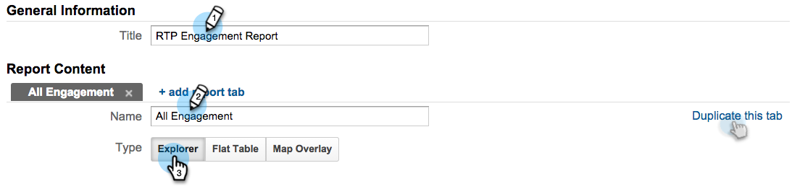
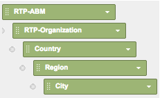

# Relatórios de RTP personalizados no Google Universal Analytics {#custom-rtp-reports-in-google-universal-analytics}

>[!PREREQUISITES]
>
>[Integrar RTP com o Google Universal Analytics](/help/marketo/product-docs/web-personalization/reporting-for-web-personalization/web-analytics-integrations/integrate-rtp-with-google-universal-analytics.md)

Este artigo explica como configurar relatórios personalizados de RTP para o Google Universal Analytics (GUA).  Os dados enviados do RTP para o GUA podem ser configurados como dois relatórios personalizados separados chamados:

* RTP B2B
* Envolvimento com RTP

## Configurando um [!UICONTROL Relatório personalizado] {#setting-up-a-custom-report}

1. Faça logon no Google Analytics.

1. Clique em **[!UICONTROL Personalização]** no menu superior.

1. Clique em **[!UICONTROL Novo Relatório Personalizado]**.

## Relatório RTP B2B {#rtp-b-b-report}

1. Nomeie o relatório **Relatório B2B RTP**.

1. Nomeie a 1ª guia **[!UICONTROL Setor]**.

>[!NOTE]
>
>Você **Duplicará esta guia** e criará outras semelhantes - etapa 5)

1. Selecione o tipo de relatório **[!UICONTROL Explorer]**.

   

1. Na seção **[!UICONTROL Grupos de Métricas]**, selecione as métricas relevantes para sua empresa.

   a. Recomendamos o seguinte:

   

1. Duplique esta guia 4 vezes e nomeie-as:

   1. **Setor**
   1. **Grupo**
   1. **Categoria**
   1. **ABM**
   1. **Organizações**

   

1. Na seção **Dimension Drill downs**, defina as dimensões relevantes para cada guia, conforme abaixo.

<table>
 <thead>
  <tr>
   <th>
    

      Nome da guia
    
</th>
   <th>
    

      Detalhes do Dimension
    
</th>
  </tr>
 </thead>
 <tbody>
  <tr>
   <td>Setor</td>
   <td></td>
  </tr>
  <tr>
   <td>Grupo</td>
   <td></td>
  </tr>
  <tr>
   <td>Categoria</td>
   <td></td>
  </tr>
  <tr>
   <td>ABM</td>
   <td></td>
  </tr>
  <tr>
   <td>Organizações</td>
   <td></td>
  </tr>
 </tbody>
</table>

1. Não defina filtros e defina este relatório para ficar disponível para **[!UICONTROL Todos os dados do site]** (ou altere se relevante para a conta específica do Analytics).

1. Clique em **[!UICONTROL Salvar]**.

   

## Relatório de engajamento RTP {#rtp-engagement-report}

1. Nomeie o relatório **Relatório de Envolvimento RTP**.

1. Defina o nome da primeira guia como **[!UICONTROL Todos os envolvimentos]**.

>[!NOTE]
>
>Você duplicará essa guia e criará outras semelhantes - etapa 5)

1. Selecione o tipo de relatório **[!UICONTROL Explorer]**.

   

1. Na seção [!UICONTROL Grupos de Métricas], selecione as métricas relevantes para sua empresa. Aqui está uma recomendação:

   

1. Duplique esta guia 4 vezes e nomeie-as:

   1. **Todos os Compromissos**
   1. **Participação por setor**
   1. **Participação por Grupo**
   1. **Participação por Categoria**
   1. **Participação da ABM**

   

1. Na seção **Dimension Drill downs**, defina as dimensões relevantes para cada guia, conforme abaixo:

<table>
 <thead>
  <tr>
   <th>
    

      Nome da guia
    
</th>
   <th>
    

      Detalhes do Dimension
    
</th>
  </tr>
 </thead>
 <tbody>
  <tr>
   <td>Todos os envolvimentos</td>
   <td></td>
  </tr>
  <tr>
   <td>Participação da ABM</td>
   <td></td>
  </tr>
  <tr>
   <td>Envolvimento por categoria</td>
   <td></td>
  </tr>
  <tr>
   <td>Envolvimento por grupo</td>
   <td></td>
  </tr>
  <tr>
   <td>Envolvimento por setor</td>
   <td></td>
  </tr>
 </tbody>
</table>

1. Defina os seguintes filtros:

<table>
 <thead>
  <tr>
   <th>
    

      Inc/Exc
    
</th>
   <th>
    

      Campo
    
</th>
   <th>
    

      Tipo de correspondência
    
</th>
   <th>
    

      Valores
    
</th>
   <th colspan="1">
    

      Comentários
    
</th>
  </tr>
 </thead>
 <tbody>
  <tr>
   <td>
Incluir
</td>
   <td>
Categoria de eventos
</td>
   <td>Regex</td>
   <td>RTP-Campanhas|RTP-Recomendações|RTP-Segmentos</td>
   <td colspan="1">Filtrará todos os outros eventos personalizados não relacionados ao RTP</td>
  </tr>
  <tr>
   <td>Excluir</td>
   <td>Rótulo do evento</td>
   <td>Regex</td>
   <td>#</td>
   <td colspan="1">Permite filtrar a partir de seus relatórios da campanha usando # no nome da campanha</td>
  </tr>
 </tbody>
</table>

1. Defina este relatório para estar disponível para **[!UICONTROL Todos os Dados do Site]** (ou altere se necessário).

   

1. Clique em **[!UICONTROL Salvar]**.

>[!MORELIKETHIS]
>
>[Integrar RTP com o Google Universal Analytics](/help/marketo/product-docs/web-personalization/reporting-for-web-personalization/web-analytics-integrations/integrate-rtp-with-google-universal-analytics.md)
>
>[Painéis RTP personalizados no Google Universal Analytics](/help/marketo/product-docs/web-personalization/reporting-for-web-personalization/web-analytics-integrations/custom-rtp-dashboards-in-google-universal-analytics.md)
