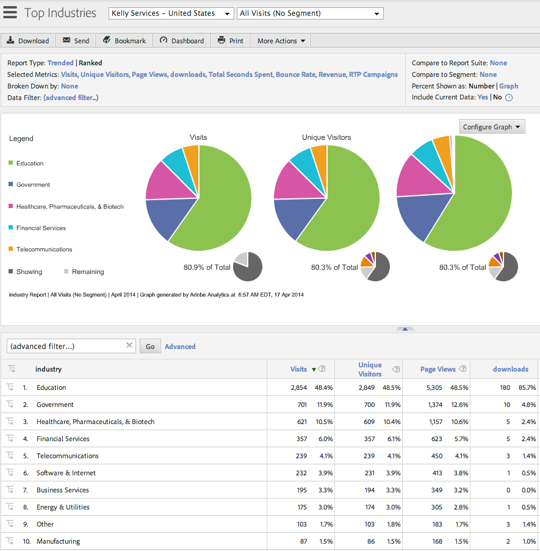

# Integração com o Adobe Analytics {#integrate-with-adobe-analytics}

## Introdução {#intro}

Analise suas análises da Web de uma perspectiva B2B ao visualizar dados de campanha da organização, do setor e da Marketo Real-Time Personalization (RTP) em sua conta do Adobe Analytics.

Este documento permite a integração entre a Marketo Real-Time Personalization (RTP) e o Adobe Adobe Analytics. Os dados da RTP permitirão detectar e analisar tendências em todos os segmentos do setor e organizações que visitam seu site e medir a eficácia das campanhas da RTP, fornecendo os insights e a análise para obter os melhores resultados.

Você pode fazer isso observando métricas como o número de visitantes novos e recorrentes em cada segmento, analisando as taxas de cliques em campanhas, e descobrindo quais setores e segmentos personalizados e campanhas em tempo real geraram os melhores clientes potenciais de conversão. Aproveite essa capacidade para obter o máximo benefício de sua conta RTP.

## Audience Analytics RTP {#rtp-audience-analytics}

Com a integração RTP-AA, você tem uma nova dimensão na interface do Web Analytics. A RTP aprimora automaticamente seus painéis de análise da Web com:

1. Dados da organização e do setor
1. Segmentos RTP personalizados
1. Listas de contas nomeadas (Account-Based Marketing)

Isso melhora seus dados B2B e permite que você se concentre em visitantes relevantes, otimizando:

1. Canais de saída
1. Conteúdo
1. Redirecionamento

## Relatório de Canal {#channel-report}

O painel RTP ajuda você a entender o detalhamento dos visitantes de acordo com setores e segmentos RTP. Você pode ver o desempenho de seus visitantes de acordo com o setor e diferentes campanhas de marketing (pagas, orgânicas, sociais) relacionadas a esse setor. O painel também fornece uma visão geral de alto nível de quais seções do site seus visitantes estão visualizando de acordo com seu tipo de setor.

## Relatório comportamental {#behavioral-report}

Relatórios de comportamento diferentes podem ser criados no Adobe Analytics com base em dados de organização, setor e segmento RTP. Esses Relatórios de fluxo visualizam o caminho que os visitantes seguem de uma página ou evento para outro. Este relatório pode ajudar você a descobrir qual conteúdo mantém os visitantes envolvidos com seu site.

## Desempenho RTP {#rtp-performance}

Visualize impressões e conversões de campanha RTP em Links personalizados no Adobe Analytics.

Este relatório de Link personalizado mostrará impressões e conversões de campanhas no seguinte formato de nomenclatura:

* Impressão ISegment: [Nome do segmento RTP], ICampaign: [Nome da campanha RTP]
* ISegment de conversão: [Nome do segmento RTP], ICampaign: [Nome da campanha RTP]

## Configurar no Adobe Analytics {#set-up-in-adobe-analytics}

A integração usa a API do JavaScript que a Adobe Analytics oferece. As variáveis de conversão personalizadas (eVar), os eventos personalizados (evento) e as variáveis de tráfego são usadas na integração. Todos devem ser ativados de um administrador AA. Você deve definir as variáveis de conversão, os eventos personalizados e as variáveis de tráfego em Ou não poderá ver os dados no conjunto mesmo se você ativá-los em RTP.

Complete as etapas a seguir para configurar essas variáveis no AA:

1. Ir para **Ferramentas administrativas** na sua conta AA.
1. Selecione o **Conjunto de relatórios** para ser usada com a integração.
1. Em **Editar configurações**, vá para **Conversão** e selecione **[Variáveis de conversão](https://microsite.omniture.com/t2/help/en_US/reference/#Edit_conversion_variables)**.\
   Selecione o [Variável de conversão](https://microsite.omniture.com/t2/help/en_US/reference/#Conversion_Variables_eVar) número (recomendamos):

   1. Evar nº 20 para conversões personalizadas do setor
   1. Evar nº 21 para conversões personalizadas de organização

   >[!NOTE]
   >
   >Se esses números forem obtidos, selecione outro número disponível. Alinhe esse número com o número do slot nas Configurações da conta RTP.

   1. Alterar Status para _Ativado_.

      1. Alterar nome para **Setor** e **Organização**. (É assim que ele aparecerá no Conjunto de relatórios.)

      1. Alterar Expirar após campo para **Visita**.

1. Em **Editar configurações** ir para **Conversão** e selecione **[Eventos bem-sucedidos](https://microsite.omniture.com/t2/help/en_US/reference/#Configure_success_events)**.

   1. Selecione o número do Evento de Eventos bem-sucedidos personalizados (recomendamos):

      1. event20 para campanhas RTP
      1. event21 para segmentos RTP

      >[!NOTE]
      >
      >Se esses números forem obtidos, selecione outro número disponível. Alinhe esse número com o número do slot nas Configurações da conta RTP.

      1. Altere os dois nomes de eventos para **Campanhas RTP** e **Segmentos RTP**. Esse é o nome que aparecerá no Conjunto de relatórios.
   1. Selecione o campo Tipo a ser **Contador (sem sub-relações)**

1. Em **Editar configurações** ir para **[Tráfego](https://microsite.omniture.com/t2/help/en_US/reference/#Traffic_Variable)** e selecione **[Variáveis de tráfego](https://microsite.omniture.com/t2/help/en_US/reference/#Enable_traffic_variable_reports)**.

   1. Selecione a propriedade da variável de tráfego # (recomendamos):

      1. Propriedade nº 20 - Nome: Organização de Segmento RTP
      1. Propriedade nº 21 - Nome: Setor do segmento RTP
      1. Propriedade nº 25 - Nome: Organização da campanha
      1. Propriedade nº 26 - Nome: Setor de Campanha RTP

      >[!NOTE]
      >
      >Se esses números forem obtidos, selecione outro número disponível. Alinhe esse número com o número do slot nas Configurações da conta RTP)

      1. Altere os 4 nomes de propriedade. Esse é o nome que aparecerá no Conjunto de relatórios.
   1. Selecione o campo Ativado para **Ativado**.

   1. Selecione o campo Relatórios de caminho para **Ativado**.

## Configurar no Marketo Real-Time Personalization (RTP) {#set-up-in-marketo-real-time-personalization-rtp}

1. Na plataforma RTP, acesse **Configurações da conta**.

   

1. Em **Configurações da conta**, clique em **Domínio**.
1. Em **Analytics, clique em** **Adobe Analytics**.
1. Turn **Ligado** As opções Conversão, Personalizado e Tráfego .
1. Atribuir as variáveis de conversão, evento e tráfego **números de slot** para corresponder aos números de slot criados em AA
1. Clique em **Salvar**.

>[!NOTE]
>
>Nossas configurações de slot recomendadas são
>
>**Variáveis de conversão**
>
>* Conversões personalizadas do setor - Slot 20
>* Conversões personalizadas da organização - Slot 21
>
>**Eventos personalizados**
>
>* Evento personalizado da campanha - Slot 20
>* Evento personalizado do segmento - Slot 21
>
>**Variáveis de tráfego**
>
>* Variável de tráfego da organização de segmento - Slot 20
>* Variável de tráfego do setor de segmentos - Slot 21
>* Variável de tráfego da organização da campanha - Slot 22
>* Variável de tráfego do setor de campanha - Slot 23
>
>**Certifique-se de que esses números de slot estejam alinhados com as variáveis e os números de eventos criados em AA.**

## Relatórios {#reports}

Crie relatórios aprimorados do SiteAdobe Analytics de acordo com nomes de organizações, setores e segmentos RTP e dados de campanhas em tempo real.

Exemplos de relatórios e painéis personalizados no AA incluem:

* Desempenho por setor ou segmento definido (listas nomeadas baseadas em conta)
* Detalhamento do setor por desempenho de KPI
* Páginas exibidas por organização
* Desempenho do canal de marketing de acordo com a Organização, Setor, Segmentos

**-Exemplos de relatório-**

**Relatório dos principais setores**

**Relatório das organizações**

**Criação do painel RTP**

Crie um [novo painel](https://microsite.omniture.com/t2/help/en_US/sc/user/t_dashboard_add.html), chamada **Painel RTP**. Esse painel ajudará a entender o detalhamento dos visitantes de acordo com setores e segmentos RTP.

1. Clique em **Painel,** click **Adicionar painel**.

1. Dê um nome ao painel **Painel RTP**.

1. Selecione o **tamanho do painel** 3 x 2, 2 x 2.

1. Crie o [reportlet](https://microsite.omniture.com/t2/help/en_US/sc/user/t_dashboard_add_report.html#task_EC3AFBBAA51C45CEBAF632F841C305B3) e adicionar [conteúdo no painel](https://docs.marketo.com/Add%2520content%2520to%2520a%2520dashboard).

Adicionar o Reportlet de setores ao painel

1. Ir para **Conversões personalizadas**, clique em **Setor**.

1. Configurar gráfico para **Gráfico de pizza**.

1. Clique em **Painel**, adicionar **Reportlet**.

1. Dê um nome ao relatório **Principais setores**.

1. Colocar no painel **Painel RTP**.

1. Criar **Novo**.

Adicionar o reportlet de segmentos ao painel

1. Ir para **Métricas de site**. Clique em **Eventos personalizados**, **Segmentos**.

1. Configurar gráfico para **Barra vertical**.

1. Clique em **Painel**, adicionar **Reportlet**.

1. Dê um nome ao relatório **Principais segmentos**.

1. Colocar no painel **Painel RTP**.

1. Criar **Novo**.

Seus reportlets serão exibidos no painel.

## Exibir impressões e cliques (conversões) no Adobe Analytics {#view-impressions-and-clicks-conversions-in-adobe-analytics}

1. Clique em **Links personalizados**.

   

1. Procure por Impressões para exibir os nomes de Segmento e Campanha representando o número de impressões da campanha.\
   

1. Procure Conversão para exibir os nomes de Segmento e Campanha representando o número de cliques para a campanha.

   
