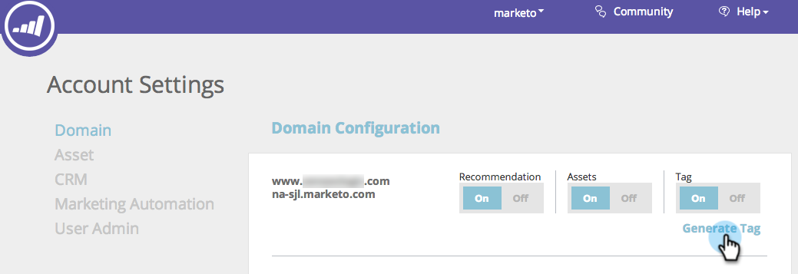

# Implantar o JavaScript RTP {#deploy-the-rtp-javascript}

Para gerar e configurar sua tag RTP, siga as instruções de instalação abaixo

## Gerar marca {#generate-tag}

1. Faça logon em sua conta RTP. Ir para **Configurações da conta**.

   

1. Em **Domínio** e **Configuração de domínio**, localize o domínio relevante e clique em **Gerar tag**.

   

1. Copie e cole a tag da Personalização da Web (RTP) em seu site.

   

   >[!NOTE]
   >
   >Copie a tag do JavaScript RTP e cole-a como o primeiro script no cabeçalho de suas páginas - entre as `<head> </head>` tags.

   Verifique se a tag aparece em todas as páginas, incluindo landing pages e subdomínios. Verifique isso clicando com o botão direito do mouse na página do seu site. Vá para Exibir fonte da página em um navegador da Web. Pesquisar: &quot;RTP&quot;.

1. Tag toggle definido como **ATIVADO**.

   Confirme se a opção Tag está definida como ON. Você deve começar a ver o fluxo de dados na guia Organização .

   Agora você está configurado com a tag RTP e pronto para iniciar [criação de segmentos](/help/marketo/product-docs/web-personalization/using-web-segments/create-a-basic-web-segment.md) e campanhas em tempo real!

1. Verifique se a tag está em todas as páginas.
