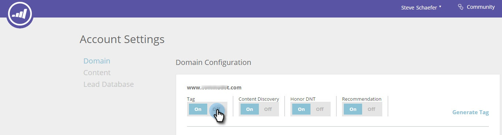

# Ativação ou desativação da tag JavaScript RTP {#enabling-or-disabling-the-rtp-javascript-tag}

A tag RTP JavaScript controla se o Web Personalization rastreia ou não a atividade da Web ou executa campanhas ou recomendações de conteúdo no seu site.

>[!NOTE]
>
>**Não é necessário remover a marca do código html no site.** Controle-o através das Configurações da Conta.

## Ativar ou desativar a tag {#enable-or-disable-the-tag}

1. Vá para **Configurações da conta**.

   

1. Em Configuração de Domínio e Domínio, em Marca, selecione **Desativado** para desabilitar a marca JavaScript.

   

   Quando a tag está definida como Desativada, o código Javascript está desativado e o Web Personalization não rastreará nenhuma atividade da Web nem executará campanhas ou recomendações de conteúdo em seu site.

1. Para habilitar a marca RTP, na Configuração de Domínio e Domínio, em Marca, selecione o botão de alternância **Ligado**.

   Fácil.
