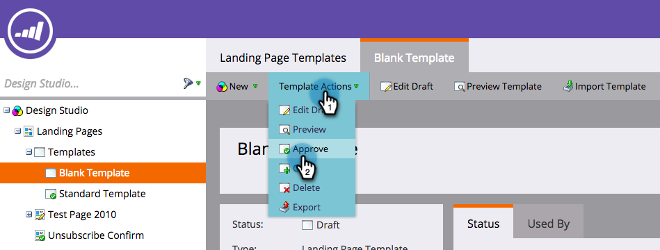

# Implementação da RTP em páginas de aterrissagem do Marketo {#implementing-rtp-on-marketo-landing-pages}

Para implementar sua tag RTP, siga as instruções de instalação abaixo:

1. Vá para o **Design Studio.** Abra o item que deseja editar. Selecionar **Ações do modelo**, selecione **Editar rascunho**.

   

1. Faça alterações no modelo na **Origem HTML** guia .

   

1. Na sua conta RTP, acesse **Configurações da conta**.

   a. Se você já recebeu sua tag JavaScript do Suporte - continue para a etapa 5.

   

1. Em Domínio, localize o domínio relevante e clique em **Gerar tag**.

   

   

1. Copie a tag do JavaScript RTP e cole-a em todos os modelos de landing page entre a **`<head> </head>`** tags.

1. Clique em **Salvar** e **Fechar** a janela .

1. De volta ao **Design Studio**, aprove a landing page de **Ações do modelo**, clique em **Aprovar**.

   

1. Por fim, você precisará **aprovar novamente** todas as landing pages que usam esse template para que o modelo tenha efeito. Você pode aprovar novamente todas de uma vez na seção Páginas de aterrissagem principal.

   

1. Verifique se ele aparece em todas as páginas, incluindo landing pages e subdomínios.

   Você pode fazer isso clicando com o botão direito do mouse na página do seu site. Ir para **Exibir fonte da página.** Procurar por **RTP** para localizar a tag.
