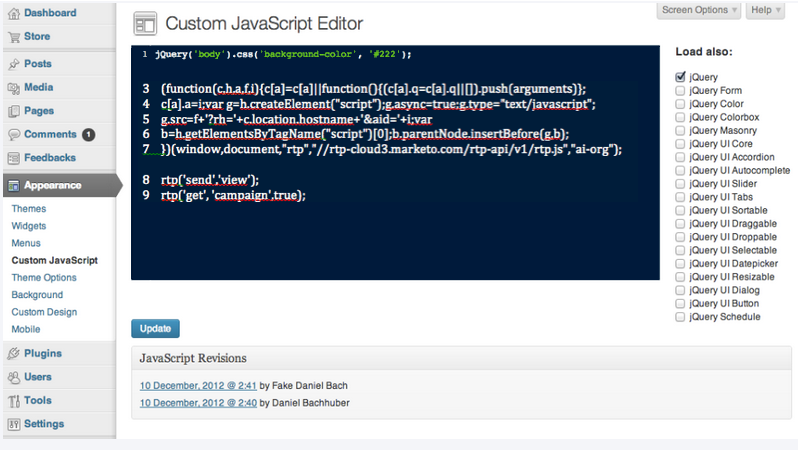

# Implementação do RTP no Wordpress Enterprise {#implementing-rtp-on-wordpress-enterprise}

Para implementar sua [!UICONTROL tag RTP], siga as instruções de instalação abaixo:

1. Vá para **[!UICONTROL Configurações da conta]**.

   a) Se você já tiver recebido sua tag do JavaScript do suporte, continue para a etapa 3.

   

1. Em [!UICONTROL Domínio], localize o domínio relevante e clique em **[!UICONTROL Gerar Marca]**.

   

1. Copie a tag RTP JavaScript.

1. Faça logon na sua conta [!DNL WordPress] como usuário administrador

   a) Em **[!UICONTROL Aparência]**, vá para **[!UICONTROL JavaScript Personalizado]**.
   b) Cole a tag RTP Javascript logo após o código existente.

   

   >[!CAUTION]
   >
   >Ao colar o código, EXCLUA as seguintes tags:
   >
   >* `<!-- RTP tag -->`
   >* ``
   >* `<!-- End of RTP tag -->`
   >
   >Insira SOMENTE o próprio script.

1. Clique **[!UICONTROL Atualizar]**.
