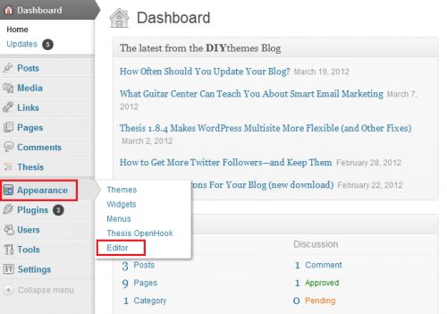

# Implementação de RTP no Wordpress {#implementing-rtp-on-wordpress}

Para implementar sua tag RTP, siga as instruções de instalação abaixo:

1. Abra o arquivo **header.php** do seu **tema do WordPress**.

   Você pode usar um cliente FTP para acessar seu servidor ou editar seus arquivos de tema diretamente do painel do WordPress. O editor de arquivos está localizado na guia **Aparência** do menu da barra lateral.

   

1. Na lista de arquivos de modelo à direita do editor de texto, encontre **header.php** e abra-o.

1. Vá para **Configurações da conta**.

   a. Se você já tiver recebido a tag do JavaScript do suporte, continue para a etapa 5.

   

1. Em Domínio, localize o domínio relevante e clique em **Gerar Marca**.

   

1. Copie a tag RTP JavaScript e cole-a nos modelos do site.

   a. Verifique se esse é o primeiro script no cabeçalho da página - entre as tags **`<head> </head>`**.

   

1. Clique em **Atualizar arquivo** para o arquivo header.php.

1. Verifique se ele aparece em todas as páginas, incluindo páginas de aterrissagem e subdomínios.

   a. Você pode fazer isso clicando com o botão direito do mouse na página do site. Vá para **Exibir Página Source.** Procure por **RTP** para localizar a marca.
