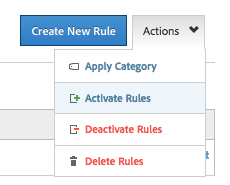

# Implementação do RTP usando o Adobe Tag Manager {#implementing-rtp-using-adobe-tag-manager}

Para implementar sua tag RTP, siga as instruções de instalação abaixo:

1. Efetue login em sua conta RTP.

1. Vá para **Configurações da conta**.

   a. Se você já tiver recebido sua tag do JavaScript do suporte, continue para a etapa 4.

   

1. Em Domínio, localize o domínio relevante e clique em **Gerar Marca**.

   

1. Faça logon em sua conta do Dynamic Tag Manager ([https://dtm.adobe.com/sign_in](https://dtm.adobe.com/sign_in)).

1. Vá para o **Painel.** Clique na propriedade da Web relevante.

   

1. Vá para **Regras**, clique em **Criar nova regra**.

1. Preencha o seguinte

   1. Nome: **Marketo RTP**
   1. Condições (recolher): Regra de acionamento em - **Início da Página**
   1. Javascript (recolher): clique em **Adicionar novo script**

   

1. Chame a nova marca: **Marca RTP do Marketo**

1. Remova o seguinte código da tag RTP

   * ``

1. Cole a tag RTP JavaScript.

   

   >[!CAUTION]
   >
   >Remova todas as marcas e deixe apenas o próprio script (sem `` )

1. Clique em **Salvar Código** no editor de scripts e em **Salvar Regra** no editor de regras.

1. No painel Regras, localize a regra de carregamento de página do Marketo RTP e, na lista suspensa **Ações**, selecione **Ativar regras**.

   

1. **Verifique** se ele aparece em todas as páginas, incluindo páginas de aterrissagem e subdomínios.

   Você pode fazer isso clicando com o botão direito do mouse nas páginas do site. Vá para **Inspect Element**, clique em **Rede**, Pesquisar: **RTP**.
