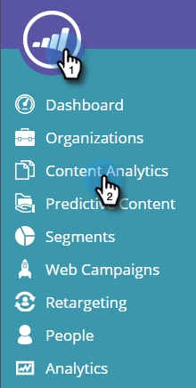

# Noções básicas sobre análise de conteúdo {#understanding-content-analytics}

A página Análise de conteúdo exibe seu conteúdo existente descoberto (estudos de caso, publicações de blog, vídeos, press releases e assim por diante) do site. Ele também exibe o desempenho do seu conteúdo e das pessoas geradas quando os visitantes se envolvem com eles.

## Exibir análise de conteúdo {#view-content-analytics}

Ir para **Análise de Conteúdo**.

Na página Análise de conteúdo, é possível:

* Filtrar por escopo de tempo (dia, semana e mês)
* Pesquisar por título de conteúdo e URL de conteúdo
* Classifique em ordem decrescente ou crescente clicando no título da coluna para Exibições, Conversões Diretas e Taxa de Conversão.

Você também pode exportar um arquivo no formato CSV clicando no ícone.

A tabela Analytics fornece os seguintes detalhes:

<table> 
 <thead> 
  <tr> 
   <th colspan="1" rowspan="1">Nome</th> 
   <th colspan="1" rowspan="1">Descrição</th> 
  </tr> 
 </thead> 
 <tbody> 
  <tr> 
   <td colspan="1" rowspan="1"><strong>Título</strong></td> 
   <td colspan="1" rowspan="1">Nome do ativo de conteúdo digital. Clique em <strong>Título</strong> para abrir a URL de Conteúdo em uma nova guia.</td> 
  </tr> 
  <tr> 
   <td colspan="1">
<strong>Recomendação </strong><strong>Ícone</strong>

</td> 
   <td colspan="1">Indica se a parte do conteúdo foi adicionada para <a href="#">Recommendations de Conteúdo</a>.</td> 
  </tr> 
  <tr> 
   <td colspan="1" rowspan="1">
<strong>Exibições</strong>
</td> 
   <td colspan="1" rowspan="1">
O número de visualizações de visitantes da Web no ativo de conteúdo. A quantidade de vezes que foi visualizado, aberto, assistido ou baixado. Clique no número de na coluna de exibições para detalhar e ver quem exibiu o conteúdo
</td> 
  </tr> 
  <tr> 
   <td colspan="1" rowspan="1"><strong>Conversões diretas</strong></td> 
   <td colspan="1" rowspan="1">Visitantes da Web que visualizaram o conteúdo e preencheram um formulário na mesma visita</td> 
  </tr> 
  <tr> 
   <td colspan="1">
<strong>Ícone do Analytics</strong>

</td> 
   <td colspan="1">Ver mais análises no conteúdo</td> 
  </tr> 
  <tr> 
   <td colspan="1">
<strong>Ícone Excluir</strong>

</td> 
   <td colspan="1">Exclui o conteúdo do Content Analytics</td> 
  </tr> 
 </tbody> 
</table>

## Exibir Análises de Conteúdo Adicionais {#view-additional-content-analytics}

Clique no ícone Analytics de um conteúdo.

Uma caixa de diálogo é aberta com Análises de conteúdo adicionais para esse conteúdo específico.

As análises de conteúdo adicionais incluem:

**Analytics**

* **Exibições**: exibições desse conteúdo para o escopo de tempo selecionado
* **Conversões diretas**: visitantes da Web que visualizaram o conteúdo e preencheram um formulário na mesma visita.
* **Taxa de Conversão**&#x200B;**:** Uma taxa de conversão de porcentagem calculada por Conversões Diretas dividida por Cliques

**Tendências**

* Um gráfico de **Tendências** que mostra os últimos 30 dias de exibição do conteúdo específico. Passe o mouse sobre o gráfico de linhas para ver o número de visualizações de conteúdo de um dia específico

## Excluir conteúdo {#delete-content}

Na página Análise de conteúdo, clique no ícone excluir do conteúdo que deseja excluir. Uma mensagem é exibida para confirmar que você deseja excluir o Conteúdo.

>[!MORELIKETHIS]
>
>* [Habilitar a Barra de Recomendação de Conteúdo](/help/marketo/product-docs/predictive-content/enabling-predictive-content/enable-the-content-recommendation-bar.md)
>* [Habilitar Conteúdo Preditivo para Mídia Avançada na Web](/help/marketo/product-docs/predictive-content/enabling-predictive-content/enable-predictive-content-for-web-rich-media.md)
