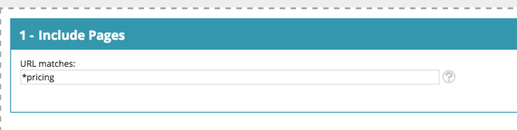

# Glossário [!DNL Web Personalization] {#web-personalization-glossary}

Alguns insights sobre o mundo e a linguagem de [!DNL Marketo Web Personalization].

| Termo | Definição |
|---|---|
| **Visitante anônimo** | Um visitante da Web que nunca preencheu um formulário ou deixou seus detalhes no site. |
| **Campanha na Web** | Uma reação personalizada associada a um segmento específico. Com o Web Personalization, as campanhas da Web incluem caixas de diálogo, Em zonas e Widgets. |
| **Sequência de cliques** | A atividade do visitante e o caminho do URL no site, e por quanto tempo ele visitou cada página |
| **ISP** | Provedor de serviços de Internet |
| **Visitante conhecido** | Um visitante da Web que concluiu um formulário e deixou seus detalhes (endereço de email) no site ou clicou em um link em um email do Marketo. |
| **Lista de contas** | Uma lista dos principais nomes de conta/organização. Também conhecida como lista do Account-Based Marketing (ABM). |
| **Segmentos** | Uma coleção de visitantes que atendem aos critérios especificados definidos na página [&#39;Definir um segmento&#39;](/help/marketo/product-docs/web-personalization/using-web-segments/web-segments.md). |
| **Teste de Divisão** | Um experimento de teste com duas ou mais variantes para medir a diferença nos resultados. O objetivo é identificar alterações nas páginas da Web que aumentem ou maximizem um resultado de interesse. |
| **Curinga** | Um caractere curinga (&#42; é usado) que é usado antes ou depois de uma cadeia de caracteres para substituir qualquer outro caractere ou caracteres em uma cadeia. Veja os exemplos abaixo. |

## Exemplos de curinga {#wildcard-examples}

Estas são três maneiras de usar um curinga no [!DNL Web Personalization].

Corresponder todos os visitantes nas URLs de página que terminam com preços (por exemplo, `www.marketo.com/pricing`

Corresponder todos os visitantes nas URLs de página que iniciam com https:// (por exemplo, `https://www.marketo.com`

Corresponder todos os visitantes nas URLs de página que incluem o backup de palavras (por exemplo, `https://www.marketo.com/backup/pricing.html`

