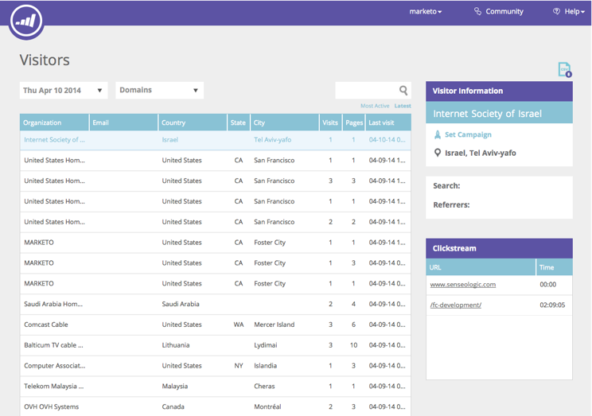

# Visão geral da personalização da Web {#web-personalization-overview}

## Introdução {#introduction}

Para novos clientes de marketing, a Personalização em tempo real é dividida em quatro aplicativos, acessados com estes dois blocos: Personalização da Web e Conteúdo`AI`.

 

>[!NOTE]
>
>A Personalização da Web e o Conteúdo`AI` estão disponíveis em todos os idiomas compatíveis com o marketing (inglês, francês, alemão, japonês, português, espanhol).

Os clientes atuais continuam a acessar os aplicativos por meio do bloco Personalização em tempo real até a renovação, e, nesse momento, usarão o logon acima.

Quando você clica no bloco Personalização da Web, a página Painel é exibida. Clique no título Conteúdo`AI` e vá diretamente para a página Recommendations de conteúdo.

Os quatro aplicativos são:

* Personalização da Web
* Marketing na Web baseado em conta
* Redefinição de metas do site
* Conteúdo`AI`

O bloco de personalização da Web** **é seu ponto de acesso para** **criar campanhas personalizadas da Web.** **Marketing na Web baseado em conta e redefinição de metas na Web. É possível adicionar conteúdo à página Análises de conteúdo.

**O Web** Marketingworks baseado em conta com personalização da Web e recursos Contas nomeadas. A página Contas Nomeadas fornece informações gráficas sobre clientes existentes, total de participações e tendências organizacionais, bem como uma lista das contas. Também é possível criar novas contas nomeadas.

**O** redirecionamento do site lhe dá o poder de recomercializar audiências segmentadas. Você pode definir segmentos, mas não pode usar Contas Nomeadas no filtro.

**Contém`AI`** o local para fornecer recomendações de conteúdo. Você pode adicionar conteúdo facilmente à página do Content Recommendations.

>[!NOTE]
>
>Para acessar o Web Marketing baseado em conta ou a redefinição de metas do site, você deve clicar no bloco Personalização da Web, mesmo se não tiver o aplicativo Personalização da Web.

## Organizações {#organizations}

A guia Organizações exibe todos os detalhes (nome, local, atividade e carimbo de data e hora) das organizações que visitaram seu site durante um determinado período. A tabela pode ser classificada e organizada por hora, local, domínio e por uma pesquisa de texto livre.

>[!TIP]
>
>&quot;Mais ativo&quot; vs. &quot;Mais recente&quot; - A tabela é organizada por organizações identificadas e, em seguida, por Provedores de serviço da Internet (indicados por um ícone de ISP). Pode ser classificada de acordo com:
>
>* Mais ativo: as organizações mais ativas na tabela, com base no número de visualizações de página
>* Mais recente: as organizações mais recentes na tabela (padrão)
>* Para obter insights valiosos, filtre de acordo com os mais ativos

>

**Organizações - Painel direito**

O painel direito da página Organizações oferta os seguintes recursos e insights:

<table> 
 <tbody> 
  <tr> 
   <td>
<strong>Ícone</strong> de planilha: Situado na parte superior direita do painel, o ícone baixa a tabela Organizações no formato CSV para uso offline

<strong>Definir alerta</strong> de email: Envia ao usuário conectado um email toda vez que a organização selecionada visita o site

<strong>Clientes potenciais</strong>: Abre a tabela de clientes potenciais para a organização selecionada

<strong>Compartilhar</strong>: Abre uma janela pop-up para enviar por email e compartilhar os detalhes da organização que visitou a página da Web

<strong>Ícone</strong> Local: Exibe o país e a cidade da organização selecionada

<strong>Links</strong>: Jigsee, Whois, Linkedin, Google, Twitter abre uma nova janela com informações adicionais da respectiva página da Web, oferecendo insight adicional sobre a organização selecionada

<strong>Pesquisar</strong>: Exibe a palavra-chave usada se o visitante chegou por meio de um mecanismo de pesquisa

<strong>Quens indicou</strong>: Mostra o link do URL da página que indicou o tráfego para o site

<strong>Visitantes</strong>: Exibe o número de visitas, o número de páginas visualizadas pela organização selecionada e seu endereço de email (se elas preencherem um formulário de envio) e a hora e a data da última visita

<strong>Sequência de cliques</strong>: Exibe uma tabela da atividade do usuário e o caminho do URL no site e o tempo que eles visitaram cada página
</td> 
   <td></td> 
  </tr> 
 </tbody> 
</table>

**Compartilhar organizações**

Deseja compartilhar as informações do visitante de seu site com um colega? Clique em uma organização e, em seguida, clique no link Compartilhar no painel direito.

Isso ativa a sobreposição Compartilhar esta organização, na qual você pode enviar um email compartilhando o nome e os detalhes da organização que visitou o site.

## Visitantes {#visitors}

A página Visitantes exibe todos os detalhes e o comportamento on-line de cada visitante que chegou ao seu site dentro de um determinado período de tempo. A página oferta um profundo insight sobre cada atividade individual e o comportamento online. Os dados do visitante na tabela são atualizados dentro de 24 a 48 horas.

O painel direito da página Visitantes fornece as seguintes informações:

<table> 
 <thead> 
  <tr> 
   <th colspan="1" rowspan="1">Nome</th> 
   <th colspan="1" rowspan="1">Descrição</th> 
  </tr> 
 </thead> 
 <tbody> 
  <tr> 
   <td colspan="1" rowspan="1"><strong>Ícone Planilha</strong></td> 
   <td colspan="1" rowspan="1">Situado na parte superior direita do painel, o ícone baixa a tabela Visitantes no formato CSV para uso offline</td> 
  </tr> 
  <tr> 
   <td colspan="1" rowspan="1">
<strong>Nome da organização</strong>
</td> 
   <td colspan="1" rowspan="1"> </td> 
  </tr> 
  <tr> 
   <td colspan="1" rowspan="1"><strong>Definir Campanha</strong></td> 
   <td colspan="1" rowspan="1">Permite configurar um CTA de Campanha associado ao visitante selecionado</td> 
  </tr> 
  <tr> 
   <td colspan="1"><strong>Localização</strong></td> 
   <td colspan="1">Exibe o país, estado e cidade do visitante</td> 
  </tr> 
  <tr> 
   <td colspan="1" rowspan="1"><strong>Clickstream</strong></td> 
   <td colspan="1" rowspan="1">Exibe uma tabela da atividade do visitante e o caminho do URL no site e quanto tempo eles visitaram cada página</td> 
  </tr> 
 </tbody> 
</table>

## Tempo real {#real-time}

A página Tempo real exibe visitantes em tempo real no seu site, medindo a atividade conforme ela acontece.

A página em tempo real é dividida em 6 tabelas informativas de detalhes do visitante no site:

<table> 
 <thead> 
  <tr> 
   <th colspan="1" rowspan="1">Nome</th> 
   <th colspan="1" rowspan="1">Descrição</th> 
  </tr> 
 </thead> 
 <tbody> 
  <tr> 
   <td colspan="1" rowspan="1"><strong>Visitantes</strong></td> 
   <td colspan="1" rowspan="1"> Representa o número de visitantes atualmente em seu site</td> 
  </tr> 
  <tr> 
   <td colspan="1" rowspan="1">
<strong>Cliques por minuto</strong>
</td> 
   <td colspan="1" rowspan="1"> Um gráfico de linha ao vivo mostrando o número de cliques em seu site por minuto</td> 
  </tr> 
  <tr> 
   <td colspan="1" rowspan="1"><strong>Principais organizações</strong></td> 
   <td colspan="1" rowspan="1">Uma versão curta da tabela Organizações</td> 
  </tr> 
  <tr> 
   <td colspan="1"><strong>Segmento em tempo real</strong></td> 
   <td colspan="1">O número de visitantes atualmente no site que correspondem aos segmentos designados</td> 
  </tr> 
  <tr> 
   <td colspan="1"><strong>Navegação atual</strong></td> 
   <td colspan="1">O URL das páginas que estão sendo visualizadas por visitantes no site</td> 
  </tr> 
  <tr> 
   <td colspan="1" rowspan="1"><strong>Principais referências</strong></td> 
   <td colspan="1" rowspan="1">O URL de referência que trouxe o visitante para o site</td> 
  </tr> 
 </tbody> 
</table>

