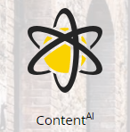

# Visão geral da personalização da Web {#web-personalization-overview}

## Introdução {#introduction}

Para novos clientes do Marketo, a Personalização em tempo real é dividida em quatro aplicativos, acessados usando estes dois blocos: Personalização da Web e ContentAI.

 

>[!NOTE]
>
>A Personalização da Web e o ContentAI estão disponíveis em todos os idiomas compatíveis com o Marketo (inglês, francês, alemão, japonês, português, espanhol).

Os clientes atuais continuam a acessar os aplicativos por meio do bloco de Personalização em tempo real até a renovação, momento em que usarão o logon acima.

Quando você clica no bloco Personalização da Web , a página Painel é exibida. Clique no bloco ContentAI e acesse diretamente a página Content Recommendations .

Os quatro aplicativos são:

* Personalização na Web
* Marketing da Web baseado em conta
* Redirecionamento de site
* ContentAI

O **Personalização da Web** bloco é seu ponto de acesso para criar campanhas personalizadas da Web. Marketing da Web baseado em conta e redirecionamento da Web. Você pode adicionar conteúdo à página Análise de conteúdo .

**Marketing da Web baseado em conta** O funciona com a Personalização da Web e os recursos Contas nomeadas. A página Contas nomeadas fornece informações gráficas sobre clientes existentes, envolvimentos totais e tendências organizacionais, bem como uma lista das contas. Também é possível criar novas contas nomeadas lá.

**Redirecionamento de site** O oferece o poder de recomercializar para públicos-alvo segmentados. Você pode definir segmentos, mas não pode usar Contas nomeadas no filtro.

**ContentAI** é o local para fornecer recomendações de conteúdo. Você pode adicionar conteúdo facilmente à página Content Recommendations .

>[!NOTE]
>
>Para acessar o Marketing baseado em conta ou o redirecionamento de site, você deve clicar no bloco Personalização da Web , mesmo que não tenha o aplicativo Personalização da Web .

## Organizações {#organizations}

A guia Organizações exibe todos os detalhes (nome, local, atividade e carimbo de data e hora) das organizações que visitaram seu site durante um determinado período. A tabela pode ser organizada e organizada por tempo, local, domínio e por uma pesquisa de texto livre.

>[!TIP]
>
>&quot;Mais ativo&quot; vs. &quot;Mais recentes&quot; - A tabela é organizada por organizações identificadas e, em seguida, provedores de serviço de Internet (denotado por um ícone ISP). Ele pode ser classificado de acordo com:
>
>* Mais ativa: as organizações mais ativas na tabela, com base no número de exibições de página
>* Mais recentes: as organizações mais recentes na tabela (padrão)
>* Para obter insights valiosos, filtre de acordo com os mais ativos

**Organizações - Painel direito**

O painel direito da página Organizações oferece os seguintes recursos e insights:

<table> 
 <tbody> 
  <tr> 
   <td>
<strong>Ícone Planilha</strong>: Situado na parte superior direita do painel, o ícone baixa a tabela Organizações no formato CSV para uso offline

<strong>Definir alerta de email</strong>: Envia um email ao usuário conectado sempre que a organização selecionada visita o site

<strong>Clientes potenciais</strong>: Abre a tabela de clientes potenciais para a organização selecionada

<strong>Compartilhar</strong>: Abre uma janela pop-up para enviar por email e compartilhar os detalhes da organização que visitou a página da Web

<strong>Ícone de Localização</strong>: Exibe o país e a cidade da organização selecionada

<strong>Links</strong>: Jigsee, Whois, Linkedin, Google, Twitter abre uma nova janela com informações adicionais da respectiva página da Web, oferecendo insight adicional sobre a organização selecionada

<strong>Pesquisar</strong>: Exibe a palavra-chave usada se o visitante chegou por meio de um mecanismo de pesquisa

<strong>Referenciadores</strong>: Mostra o link do URL da página que fez referência ao tráfego para o site

<strong>Visitantes</strong>: Exibe o número de visitas, o número de páginas visualizadas pela organização selecionada e seu endereço de email (se ele tiver preenchido um formulário de envio) e a hora e a data da última visita

<strong>Sequência de cliques</strong>: Exibe uma tabela da atividade do usuário e o caminho do URL no site, além do tempo que eles visitaram cada página
</td> 
   <td></td> 
  </tr> 
 </tbody> 
</table>

**Compartilhar organizações**

Deseja compartilhar as informações do visitante de seu site com um colega? Clique em uma Organização e no link Compartilhar no painel do lado direito.

Isso ativa a sobreposição Compartilhar esta organização, onde é possível enviar um email compartilhando o nome e os detalhes da organização que visitou o site.

## Visitantes {#visitors}

A página Visitantes exibe todos os detalhes e o comportamento online de cada visitante que chegou ao site dentro de um determinado período de tempo. A página oferece um profundo insight sobre as atividades de cada visitante individual e o comportamento online. Os dados do visitante na tabela são atualizados dentro de 24 a 48 horas.

O painel direito da página Visitantes fornece os seguintes insights:

<table> 
 <thead> 
  <tr> 
   <th colspan="1" rowspan="1">Nome</th> 
   <th colspan="1" rowspan="1">Descrição</th> 
  </tr> 
 </thead> 
 <tbody> 
  <tr> 
   <td colspan="1" rowspan="1"><strong>Ícone Planilha</strong></td> 
   <td colspan="1" rowspan="1">Situado na parte superior direita do painel, o ícone baixa a tabela Visitantes em formato CSV para uso offline</td> 
  </tr> 
  <tr> 
   <td colspan="1" rowspan="1">
<strong>Nome da organização</strong>
</td> 
   <td colspan="1" rowspan="1"> </td> 
  </tr> 
  <tr> 
   <td colspan="1" rowspan="1"><strong>Definir campanha</strong></td> 
   <td colspan="1" rowspan="1">Permite configurar um CTA de campanha associado ao visitante selecionado</td> 
  </tr> 
  <tr> 
   <td colspan="1"><strong>Local</strong></td> 
   <td colspan="1">Exibe o país, o estado e a cidade do visitante</td> 
  </tr> 
  <tr> 
   <td colspan="1" rowspan="1"><strong>Fluxo de cliques</strong></td> 
   <td colspan="1" rowspan="1">Exibe uma tabela da atividade e do caminho do URL do visitante no site, além do tempo que ele visitou cada página</td> 
  </tr> 
 </tbody> 
</table>

## Tempo real {#real-time}

A página Tempo real exibe os visitantes do seu site em tempo real, avaliando a atividade como acontece.

A página em tempo real é dividida em 6 tabelas informativas de detalhes do visitante no site:

<table> 
 <thead> 
  <tr> 
   <th colspan="1" rowspan="1">Nome</th> 
   <th colspan="1" rowspan="1">Descrição</th> 
  </tr> 
 </thead> 
 <tbody> 
  <tr> 
   <td colspan="1" rowspan="1"><strong>Visitantes</strong></td> 
   <td colspan="1" rowspan="1"> Representa o número de visitantes atualmente em seu site</td> 
  </tr> 
  <tr> 
   <td colspan="1" rowspan="1">
<strong>Cliques por minuto</strong>
</td> 
   <td colspan="1" rowspan="1"> Um gráfico de linha ao vivo que mostra o número de cliques no site por minuto</td> 
  </tr> 
  <tr> 
   <td colspan="1" rowspan="1"><strong>As melhores organizações</strong></td> 
   <td colspan="1" rowspan="1">Uma versão curta da tabela Organizações</td> 
  </tr> 
  <tr> 
   <td colspan="1"><strong>Segmento em tempo real</strong></td> 
   <td colspan="1">O número de visitantes no site que correspondem aos segmentos designados</td> 
  </tr> 
  <tr> 
   <td colspan="1"><strong>Atualmente pesquisando</strong></td> 
   <td colspan="1">O URL das páginas que estão sendo visualizadas por visitantes no site</td> 
  </tr> 
  <tr> 
   <td colspan="1" rowspan="1"><strong>As melhores indicações</strong></td> 
   <td colspan="1" rowspan="1">O URL de referência que trouxe o visitante para o seu site</td> 
  </tr> 
 </tbody> 
</table>
