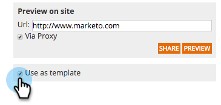

# Salve sua campanha como um modelo {#save-your-campaign-as-a-template}

Você já passou algum tempo criando a campanha web perfeita? Agora você pode salvá-lo como um modelo para reutilização fácil no futuro.

1. Ir para **Campanhas da Web**.

   

1. Procure a campanha que deseja salvar como template.

   

1. Clique no ícone Editar .

   

1. Marque Usar como modelo e clique em **Salvar**.

      

1. Pronto! Na próxima vez que você criar uma campanha e selecionar um modelo, marque Meus modelos na página Definir campanhas para ver os modelos que você salvou.

   
