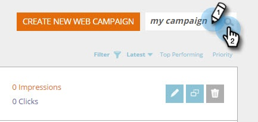

# Salvar sua Campanha como um modelo {#save-your-campaign-as-a-template}

Você já passou algum tempo criando a campanha da web perfeita? Agora você pode salvá-lo como um modelo para fácil reutilização no futuro.

1. Vá para Campanhas da Web.

   

1. Procure a campanha que deseja salvar como um modelo.

   

1. Clique no ícone Editar.

   

1. Marque Usar como modelo e clique em Salvar.

      

1. É isso! Na próxima vez que você criar uma campanha e selecionar um modelo, marque Meus modelos na página Definir Campanhas para ver os modelos que você salvou.

   

