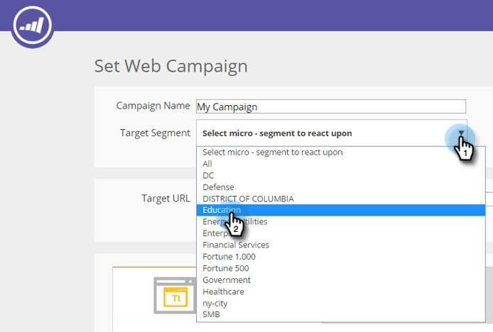
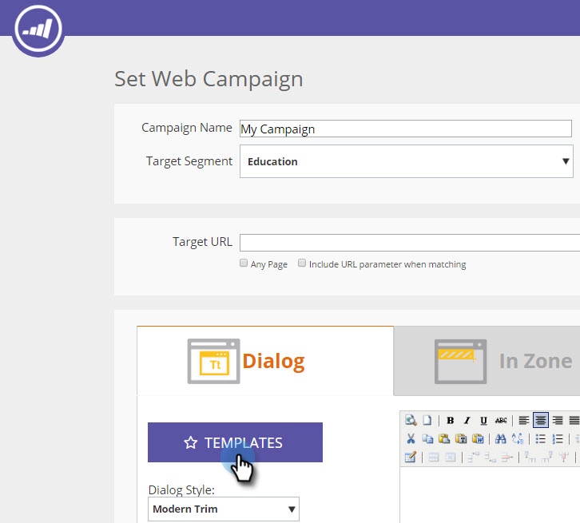

# Uso de modelos para criar campanhas da web {#using-templates-to-create-web-campaigns}

Acelere e simplifique seu processo de criação de campanha na Web usando nossos modelos integrados ou [salvando o seu próprio](save-your-campaign-as-a-template.md).

>[!NOTE]
>
>Os modelos são otimizados para todos os dispositivos e experiências de navegação para desktop e dispositivos móveis.

1. Vá para **[!UICONTROL Campanhas da Web]**.

   

1. Clique em **[!UICONTROL Criar nova campanha da Web]**.

   

1. Dê um nome à sua campanha.

   

1. Selecione um [!UICONTROL Segmento de Destino].

   

1. Clique em **[!UICONTROL Modelos]**.

   

1. Selecione a área apropriada para a sua campanha para ver e selecionar um template que funcione para você.

   >[!NOTE]
   >
   >Existem alguns templates interessantes para escolher, e adicionaremos mais no futuro.

   

   >[!TIP]
   >
   >Para campanhas móveis, selecione um modelo na seção **móvel**.

1. Personalize o modelo.

   

1. Clique em **[!UICONTROL Salvar]**.

   

Muito bem! Você viu quanto tempo economizou usando um modelo?

>[!MORELIKETHIS]
>
>[Salvar uma campanha como um modelo](/help/marketo/product-docs/web-personalization/using-templates/save-your-campaign-as-a-template.md)
