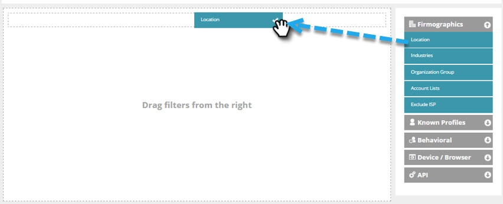

# Criar um segmento básico da Web {#create-a-basic-web-segment}

Vamos criar um segmento básico direcionado a todos os visitantes da Web dos EUA e do setor de serviços financeiros.

1. Vá para **[!UICONTROL Segmentos]**.

   

1. Clique em **[!UICONTROL Criar novo]**.

   

1. Insira o nome do segmento.

   

1. Arraste **[!UICONTROL Local]** do menu à direita e solte-o no editor de segmentos.

   

1. Selecione um país para adicionar no menu suspenso. Selecione os **Estados Unidos**.

   

   >[!NOTE]
   >
   >O número de cidades é limitado a 300 por segmento.

1. Arraste **[!UICONTROL Indústrias]** do menu à direita e solte-o no editor de segmentos.

   

1. Selecione [!UICONTROL Setores] para adicionar no menu suspenso. Selecione o **[!UICONTROL Setor de Serviços Financeiros]**.

   

   Agora você configurou um segmento básico para todos os prospetos que visitam seu site nos EUA e no Setor Financeiro.

1. Clique em **[!UICONTROL Salvar]** para salvar o segmento ou **[!UICONTROL Salvar e definir a campanha]** para ir para a página Campanhas.

   

Agora que segmentou seus visitantes dos Estados Unidos, você pode adicionar o setor de serviços financeiros.

>[!MORELIKETHIS]
>
>[Segmentos da Web](/help/marketo/product-docs/web-personalization/using-web-segments/web-segments.md)
