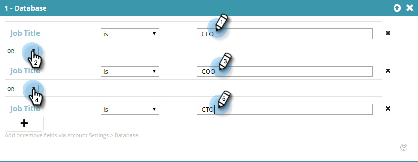

# Criar um segmento usando dados de uma pessoa conhecida {#create-a-segment-using-known-person-data}

Veja como criar um segmento usando valores de Dados de pessoas conhecidas.

>[!PREREQUISITES]
>
>[Gerenciar dados da pessoa](/help/marketo/product-docs/web-personalization/using-web-segments/manage-person-data.md)

1. Vá para **[!UICONTROL Segmentos]**.

   

1. Clique em **[!UICONTROL Criar novo]**.

   

1. Informe um Nome de segmento.

   

1. Na Segmentação de Perfil, arraste o **[!UICONTROL Banco de Dados]** para a tela.

   

1. Selecione um campo de dados da pessoa no menu suspenso.

   

1. Informe um valor de Dados da Pessoa.

   

   Só pode haver um valor para cada campo. Por exemplo, se você quiser adicionar vários valores para o campo de título do trabalho, será necessário criar uma nova linha com o mesmo nome de campo para cada valor. Certifique-se de usar o valor OR para garantir que qualquer valor capture uma correspondência.

   

## Seleção de Vários Campos de Dados Pessoais {#selecting-multiple-person-data-fields}

1. Clique em **+** para adicionar outro campo de dados de pessoa.

   

1. Selecione o operador [!UICONTROL AND]/[!UICONTROL OR]. Selecione o campo a ser adicionado. Selecione um Campo de dados da pessoa. Informe o Valor dos Dados Pessoais.

   

1. Clique em **[!UICONTROL Salvar]** para salvar o segmento ou **[!UICONTROL Salvar e definir a campanha]** para salvar e ir para a página [!UICONTROL Campanhas].

   

   Agora você configurou um segmento direcionado a dados de Pessoa conhecida.
