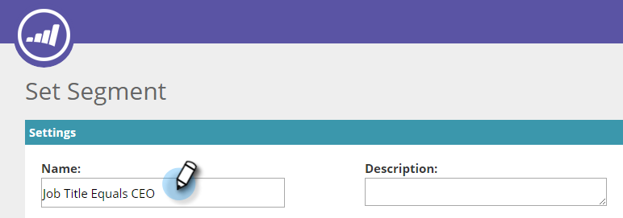

# Criar um segmento usando dados de pessoa conhecida {#create-a-segment-using-known-person-data}

Veja como criar um segmento usando valores de Dados de pessoa conhecida.

>[!NOTE]
>
>**Pré-requisitos**
>
>[Gerenciar dados da pessoa](manage-person-data.md)

1. Ir para **Segmentos**.

   

1. Clique em **Criar novo**.

   

1. Insira um Nome de segmento.

   

1. Na Segmentação do Perfil, arraste **Banco de dados **sobre para a tela.

   

1. Selecione um campo de dados de pessoa no menu suspenso.

   

1. Insira um valor de Dados de pessoa.

   

   Só pode haver um valor para cada campo. Por exemplo, se você deseja adicionar vários valores para o campo de título da tarefa, é necessário criar uma nova linha com o mesmo nome de campo para cada valor. Certifique-se de usar o valor OU para garantir que qualquer valor capture uma correspondência.

   

## Seleção de campos de dados de várias pessoas {#selecting-multiple-person-data-fields}

1. Clique em **+** para adicionar outro campo de dados de pessoa.

   

1. Selecione o operador E/OU. Selecione o campo a ser adicionado. Selecione um campo de dados de pessoa. Informe o Valor dos Dados da Pessoa.

   

1. Clique em **Salvar** para salvar o segmento ou **Salvar e definir Campanha **para salvar e ir para a página Campanhas.

   

   Agora você configura uma segmentação de segmentos para dados de Pessoa conhecida.

