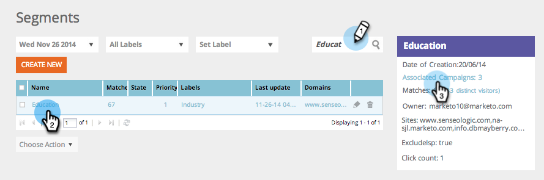

# Localizar campanhas da web que estão usando um segmento específico {#find-web-campaigns-that-are-using-a-specific-segment}

Procurando campanhas da Web que usam um segmento específico?

1. Vá para **[!UICONTROL Segmentos]**.

   

1. Procure por um **Segmento**. Selecione o **Nome do segmento**. No painel direito, clique em **[!UICONTROL Campanhas associadas]** para exibir as campanhas associadas a este segmento específico.

   

1. Exiba as **Campanhas** associadas ao segmento selecionado.

   

>[!MORELIKETHIS]
>
>Saiba mais sobre [segmentos](/help/marketo/product-docs/web-personalization/using-web-segments/web-segments.md) e como [criar um segmento básico](/help/marketo/product-docs/web-personalization/using-web-segments/create-a-basic-web-segment.md).
