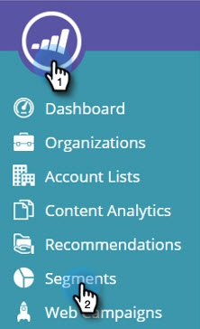

# Rotular o segmento {#label-your-segment}

Você tem tantos segmentos que a rolagem está se tornando complicada? Use rótulos para marcar seus segmentos para que você possa encontrá-los rapidamente.

## Marcar um segmento {#tag-a-segment}

1. Faça logon em [!DNL Web Personalization] e vá para **[!UICONTROL Segmentos]**.

   

1. Selecione os segmentos que deseja marcar com um rótulo.

   

1. Para usar um rótulo existente, clique em **[!UICONTROL Definir rótulo]**, marque uma caixa e clique em **[!UICONTROL Aplicar]**.

   

1. Ou, para criar um novo rótulo, clique em **[!UICONTROL Definir Rótulo]**, insira o novo nome de rótulo e clique em **Criar Novo**.

   

   >[!NOTE]
   >
   >O botão Criar novo mostra o nome do novo rótulo. Se o rótulo for muito longo, &quot;Criar novo&quot; pode não aparecer lá.

Legal! Agora você sabe como atribuir e criar rótulos para segmentos.
