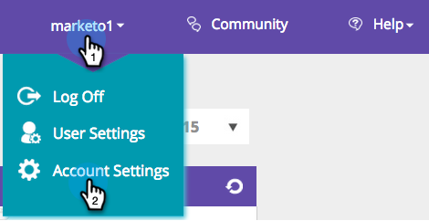

# Gerenciar dados de pessoa {#manage-person-data}

Aproveite os Dados da pessoa para [!DNL Web Personalization] selecionando os campos de pessoa a serem usados na segmentação.

1. Vá para **[!UICONTROL Configurações da conta]**.

   

1. Ir para **[!UICONTROL Banco de Dados]**.

   

## Adição de um campo Nova pessoa {#adding-a-new-person-field}

1. Selecione o **Campo a ser adicionado** no menu suspenso para adicionar um campo de dados de pessoa à lista.

   

   >[!NOTE]
   >
   >Um novo campo é adicionado em um estado pendente e pode levar até 24 horas para ser ativado.

## Deletando um Campo de Pessoa {#deleting-a-person-field}

1. Clique no ícone de exclusão ( ) para remover um campo da lista. Clique em **[!UICONTROL Sim]** para confirmar que deseja excluir o campo.

   

   >[!NOTE]
   >
   >**Gerenciando campos de Dados da Pessoa**
   >
   >* Somente campos de dados de pessoas podem ser incluídos
   >* Você pode adicionar até 30 campos de dados pessoais
   >* A ativação de novos campos pode demorar até 24 horas
   >* A extensão máxima dos tipos de sequências é de 255 caracteres
   >* Campos ocultos serão removidos automaticamente

<table>
 <tbody>
  <tr>
   <th>
Nome da API REST
</th>
   <th>
Nome da API SOAP
</th>
   <th>
Nome intuitivo
</th>
  </tr>
  <tr>
   <td>
departamento
</td>
   <td>
Departamento
</td>
   <td>
Departamento
</td>
  </tr>
  <tr>
   <td>
título
</td>
   <td>
Título
</td>
   <td>
Nome do cargo
</td>
  </tr>
  <tr>
   <td>
avaliação
</td>
   <td>
Classificação
</td>
   <td>
Classificação
</td>
  </tr>
  <tr>
   <td>
leadScore
</td>
   <td>
LeadScore
</td>
   <td>
Pontuação
</td>
  </tr>
  <tr>
   <td>
leadStatus
</td>
   <td>
LeadStatus
</td>
   <td>
Status
</td>
  </tr>
  <tr>
   <td>
prioridade
</td>
   <td>
Prioridade
</td>
   <td>
Prioridade
</td>
  </tr>
  <tr>
   <td>
leadRole
</td>
   <td>
LeadRole
</td>
   <td>
Função
</td>
  </tr>
  <tr>
   <td>
cancelado
</td>
   <td>
Inscrição cancelada
</td>
   <td>
Inscrição cancelada
</td>
  </tr>
 </tbody>
</table>

Os campos de cliente em potencial a seguir são fornecidos imediatamente para novas contas do [!DNL Web Personalization]:

>[!MORELIKETHIS]
>
>[Criar um segmento usando dados de pessoas conhecidas](/help/marketo/product-docs/web-personalization/using-web-segments/create-a-segment-using-known-person-data.md)
