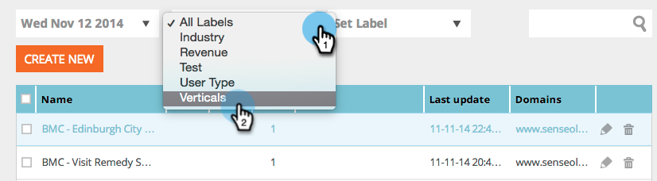

# Visualização de segmentos a partir de um rótulo específico {#view-segments-from-a-specific-label}

Você está procurando visualização e filtrar seus segmentos de acordo com um rótulo específico?

## Filtrar por rótulos existentes {#filter-by-existing-labels}

Na lista suspensa de rótulos, selecione o rótulo de sua escolha.

Excelente, agora só mostramos os segmentos associados ao rótulo selecionado?

