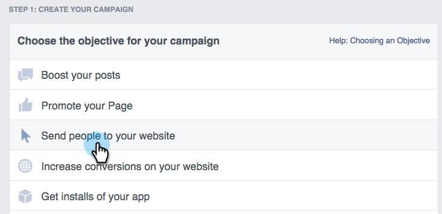

# Remarketing personalizado em [!DNL Facebook] {#personalized-remarketing-in-facebook}

O Remarketing personalizado permite que você se envolva novamente com seus usuários usando dados RTP e o poder do Remarketing do Facebook.

>[!PREREQUISITES]
>
>* Concluir a configuração de [Redirecionamento com Dados do Web Personalization](/help/marketo/product-docs/web-personalization/website-retargeting/retargeting-with-web-personalization-data.md)
>* Revise a [&#128279;](https://developers.facebook.com/docs/ads-for-websites/website-custom-audiences/getting-started#install-the-pixel) [documentação do Facebook sobre Públicos-alvo personalizados](https://developers.facebook.com/docs/ads-for-websites/website-custom-audiences/getting-started#install-the-pixel) e Remarketing.

## Criando um Público-alvo em [!DNL Facebook] {#creating-an-audience-in-facebook}

1. No [!DNL Facebook], vá para a [guia Público-alvo](https://www.facebook.com/ads/audience_manager) do Ads Manager.

1. Clique em **[!UICONTROL Ferramentas]** e selecione **[!UICONTROL Públicos]**.

1. Clique em **[!UICONTROL Criar um público-alvo personalizado]**.

1. Selecione **[!UICONTROL Tráfego de Site]**.

1. Na lista [!UICONTROL Tráfego de site], selecione **[!UICONTROL Combinação Personalizada]**.

1. Na lista Incluir, selecione **[!UICONTROL Evento]**.

1. Na lista [!UICONTROL Evento], selecione **[!UICONTROL RTP Remarketing]** e escolha um parâmetro.

1. Neste exemplo, selecione [!UICONTROL Setor] para conter **[!UICONTROL Educação]**. Insira **[!UICONTROL Educação]** e edite **[!UICONTROL Nos Últimos]** para ter 180 dias. Insira O Nome Do Público: **Setor De Educação**. Clique em **[!UICONTROL Criar Público]**.

1. Agora você criou um novo público-alvo personalizado usando dados RTP em [!DNL Facebook].

## Pontos de Dados RTP em [!DNL Facebook] {#rtp-data-points-in-facebook}

<table>
 <tbody>
  <tr>
   <th>Nome do evento</th>
   <th> </th>
  </tr>
  <tr>
   <td>Remarketing RTP</td>
   <td>
    

     <table>
      <tbody>
       <tr>
        <th>Parâmetro</th>
        <th>Valor</th>
       </tr>
       <tr>
        <td>Lista ABM</td>
        <td>(Nome da lista baseada em conta)</td>
       </tr>
       <tr>
        <td colspan="1">Categoria</td>
        <td colspan="1">
Fortune 500

Fortune 1000

Global 2000
</td>
       </tr>
       <tr>
        <td colspan="1">Grupo</td>
        <td colspan="1">
Enterprise

SMB
</td>
       </tr>
       <tr>
        <td>Setor</td>
        <td>
Defesa

Educação

Serviços financeiros

Governo

Saúde, Farmácia, Biotecnologia

Software e Internet

etc... (de acordo com as opções do RTP Industry)
</td>
       </tr>
       <tr>
        <td colspan="1">Público segmentado</td>
        <td colspan="1">(Nome do público-alvo segmentado criado no RTP)</td>
       </tr>
      </tbody>
     </table>
    
</td>
  </tr>
 </tbody>
</table>

## Direcione seu público com um anúncio {#target-your-audience-with-an-ad}

Para obter detalhes adicionais, consulte [documentação do Facebook](https://developers.facebook.com/docs/ads-for-websites/website-custom-audiences/getting-started#target-your-audience).

1. Vá para o Gerenciador de Anúncios, clique em **[!UICONTROL Criar Anúncio]**.

   

1. Selecione **[!UICONTROL Enviar pessoas para o seu site]** como objetivo da campanha.

   

1. Insira o URL do site.

   

1. Crie seu conjunto de anúncios. Selecione um público-alvo personalizado na lista de públicos-alvo criada, por exemplo, Setor de educação.

   

1. Selecione todas as outras opções de conjunto de anúncios, defina seu orçamento e seus anúncios criativos.

   

1. Agora você está pronto para uma campanha de remarketing personalizada no [!DNL Facebook].

>[!MORELIKETHIS]
>
>* [Redirecionamento com dados do Web Personalization](/help/marketo/product-docs/web-personalization/website-retargeting/retargeting-with-web-personalization-data.md)
>* [Remarketing personalizado no Google](/help/marketo/product-docs/web-personalization/website-retargeting/personalized-remarketing-in-google.md)
