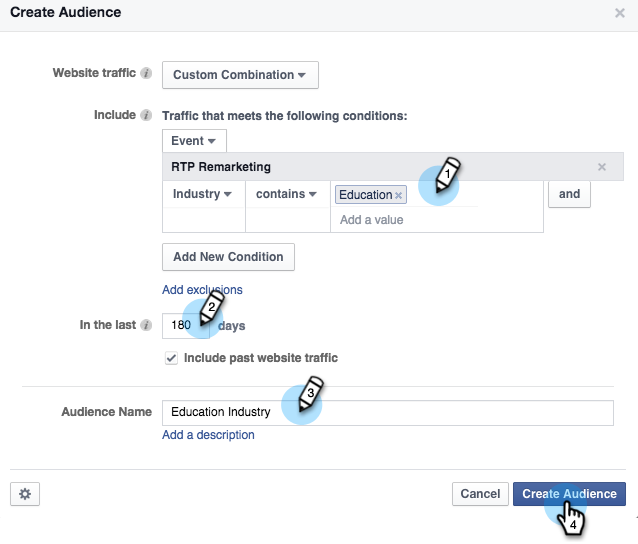

# Comentários personalizados no Facebook {#personalized-remarketing-in-facebook}

A recomercialização personalizada permite que você se envolva novamente com seus usuários usando os dados RTP e o poder da recomercialização do Facebook.

>[!PREREQUISITES]
>
>* Conclua a [redefinição de metas com a configuração de dados](retargeting-with-web-personalization-data.md) de personalização da Web
>* Revise a documentação do  Facebook em Públicos-alvo personalizados e Comentários

>

## Criação de uma Audiência no Facebook {#creating-an-audience-in-facebook}

1. No Facebook, vá para a guia  Audiência no Gerenciador de anúncios.
1. Clique em **Ferramentas** e selecione **Audiência**.

   

1. Clique em **Criar uma Audiência** personalizada.

   

1. Selecione Tráfego **do site**.

   

1. Na lista de tráfego do site, selecione** Combinação personalizada**.

   

1. Na lista Incluir, selecione **Evento**.

   

1. Na lista do Evento, selecione **RTP Remarketing **e selecione um parâmetro.

   

1. Neste exemplo, selecione Indústria para conter **Educação**. Entre em **Educação** e edite **Nos últimos** 180 dias. Digite o nome da Audiência: **Indústria** educacional. Clique em **Criar Audiência**.

   

1. Agora você criou uma nova audiência personalizada usando dados RTP no Facebook.

   

## Pontos de dados RTP no Facebook {#rtp-data-points-in-facebook}

<table> 
 <tbody> 
  <tr> 
   <th>Nome do evento</th> 
   <th> </th> 
  </tr> 
  <tr> 
   <td>Remarketing RTP</td> 
   <td> 
    
 
     <table> 
      <tbody> 
       <tr> 
        <th>Parâmetro</th> 
        <th>Valor</th> 
       </tr> 
       <tr> 
        <td>LISTA ABM</td> 
        <td>(Nome da Lista baseada em conta)</td> 
       </tr> 
       <tr> 
        <td colspan="1">Categoria</td> 
        <td colspan="1">
Fortune 500

Fortune 1000

Global 2000
</td> 
       </tr> 
       <tr> 
        <td colspan="1">Grupo</td> 
        <td colspan="1">
Empresa

SMB
</td> 
       </tr> 
       <tr> 
        <td>Indústria</td> 
        <td>
Defesa

Educação

Serviços financeiros

Governo

Saúde, Pharma, Biotech

Software e Internet

etc... (conforme as opções do setor RTP)
</td> 
       </tr> 
       <tr> 
        <td colspan="1">Audiência segmentada</td> 
        <td colspan="1">(Nome da Audiência segmentada criada no RTP)</td> 
       </tr> 
      </tbody> 
     </table> 
    
</td> 
  </tr> 
 </tbody> 
</table>

## Público alvo de sua Audiência com um anúncio {#target-your-audience-with-an-ad}

Para obter detalhes adicionais, consulte a documentação [do](https://developers.facebook.com/docs/ads-for-websites/website-custom-audiences/getting-started#target-your-audience)Facebook.

1. Vá para Gerenciador de publicidade e clique em **Criar anúncio**.

   

1. Selecione **Enviar pessoas para seu site** como o objetivo de sua campanha.

   

1. Insira o URL do site.

   

1. Crie seu conjunto de anúncios. Selecione uma audiência personalizada na lista de Audiências que você criou, por exemplo, Setor de Educação.

   

1. Selecione todas as outras opções de conjunto de anúncios, defina seu orçamento e defina seus anúncios.

   

1. Agora todos vocês estão configurados com uma campanha de remarketing personalizada no Facebook.

>[!NOTE]
>
>**Artigos relacionados**
>
>* [Redefinição de metas com dados de personalização da Web](retargeting-with-web-personalization-data.md)
>* [Comentários personalizados no Google](personalized-remarketing-in-google.md)

>

