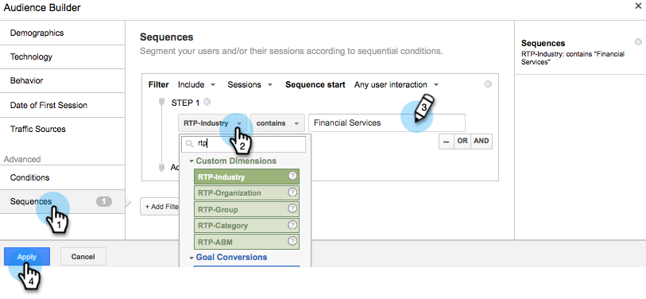

# Comentários personalizados no Google {#personalized-remarketing-in-google}

A recomercialização personalizada permite que você se envolva novamente com seus usuários usando dados RTP e o poder dos Google Analytics com o alcance do Google Display Network.

>[!PREREQUISITES]
>
>* Conclua a configuração [Redefinição de metas com dados de personalização da Web](retargeting-with-web-personalization-data.md)
>* Revisar a documentação [Compartilhamento com a Ajuda do Google Analytics](https://support.google.com/analytics/topic/2611283?hl=en&amp;ref_topic=3413645)

>

## Criando uma Audiência de recomercialização no Google {#creating-a-remarketing-audience-in-google}

1. Faça logon em seus Google Analytics. Clique em **Admin**, **Conta**, **Propriedade**. Clique em **Definições de Audiência** e **Audiência**.

   

1. Clique em **+Nova Audiência**.

   

1. **Configuração** do link: Link para sua conta do Google Adwords
1. **Definir Audiência**: Clique em  **Criar novo**.

   

1. No Construtor de Audiências, clique em **Sequências** e **Localize os dados RTP** em Dimension personalizados, Variáveis personalizadas e Eventos.

>[!TIP]
>
>Como localizar os dados RTP no Analytics para criar sua audiência?
>
>Em Google Analytics:
>
>* Variáveis personalizadas: Organização, Indústria
>* Categoria do evento: Segmento, Insightera-CTA, RTP-Remarketing
>* Etiqueta do evento: Nome do segmento, Nome da Campanha, Nome da Audiência segmentada

>
>
No Google Universal Analytics:
>
>* Dimension personalizados: Organização, Indústria, Categoria (Fortune 500,1000, Global 2000), Grupo (Empresa, SMB), Lista ABM (Lista de conta nomeada)
>* Categoria do evento: RTP-Segment, RTP-Campanha RTP-Remarketing
>* Etiqueta do evento: Nome do segmento, Nome da Campanha, Nome da Audiência segmentada

>

**Exemplo de Audiência de recomercialização dos dados de Audiência segmentados RTP**

1. Clique em **Sequências.**
1. Selecione **Rótulo do Evento.**
1. Insira **Nome da Audiência segmentada** (como aparece no RTP).
1. Clique em **Aplicar**.

**Exemplo de Audiência dos dados do setor RTP**

1. Clique em **Sequências**.
1. Selecione** RTP-Indústria**.
1. Digite **Nome do Setor** (por exemplo, Serviços Financeiros, Educação...).
1. Clique em **Aplicar**.
1. Digite um **Nome da Audiência**. Clique em **Salvar**.

## Criar uma Campanha de anúncio de recomercialização no Google Adwords {#create-a-remarketing-ad-campaign-in-google-adwords}

1. Faça logon em **Google Adwords**. Clique em **Campanha**, selecione **Exibir somente rede**.

   

1. Digite **Nome da Campanha**, Selecione **Registro de Tipo.**

   

1. Digite **Nome do grupo de publicidade,** digite **CPC aprimorado**, selecione **Lista de recomercialização**.

   

1. Clique em Salvar e continue.
1. Adicione sua imagem ou publicidade em texto e start sua campanha de remarketing.

   

>[!MORELIKETHIS]
>
>* [Redefinição de metas com dados de personalização da Web](retargeting-with-web-personalization-data.md)
>* [Comentários personalizados no Facebook](personalized-remarketing-in-facebook.md)

