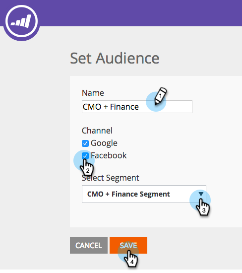

# Redirecionamento com dados de personalização da Web {#retargeting-with-web-personalization-data}

>[!AVAILABILITY]
>
>O redirecionamento do site agora se enquadra no bloco Personalização da Web . Se você só comprou o Redirecionamento, verá este bloco e acessará o produto de Personalização da Web com **only** Recursos de redirecionamento ativados. Isso dá acesso às configurações da conta, à página de redirecionamento, aos segmentos e às páginas de rastreamento adicionais.

O remarketing direciona os clientes potenciais que visitaram seu site no passado com anúncios de exibição com base em quem eles são e o que eles fizeram. O redirecionamento personalizado direciona públicos-alvo específicos com anúncios relevantes com base no setor, em contas nomeadas e em dados de pessoas conhecidas.

A Personalização da Web anexa dados às seguintes plataformas de remarketing:

* [Google](/help/marketo/product-docs/web-personalization/website-retargeting/personalized-remarketing-in-google.md)
* [Facebook](/help/marketo/product-docs/web-personalization/website-retargeting/personalized-remarketing-in-facebook.md)

A Personalização da Web envia os seguintes dados para as plataformas de remarketing para criar públicos e executar campanhas de remarketing:

<table> 
 <tbody> 
  <tr> 
   <th colspan="1">Dados de personalização da Web</th> 
  </tr> 
  <tr> 
   <th>
Setor
</th> 
  </tr> 
  <tr> 
   <th>
Grupo (Empresa, SMB)
</th> 
  </tr> 
  <tr> 
   <th>
Categoria (Fortune 500/1000, Global 2000)
</th> 
  </tr> 
  <tr> 
   <th>
Lista ABM (Listas de Contas Nomeadas)
</th> 
  </tr> 
  <tr> 
   <th>
Público-alvo segmentado (com base em segmentos)
</th> 
  </tr> 
  <tr> 
   <th>
Campanhas da Web clicadas
</th> 
  </tr> 
 </tbody> 
</table>

## Configuração de recomercialização {#remarketing-configuration}

1. Ir para **Redirecionamento**.

   

   >[!NOTE]
   >
   >A Configuração de redirecionamento é por domínio ou subdomínio. Ative os outros domínios se desejar enviar dados desses domínios para a plataforma de redefinição de metas.

1. Ativar configurações para Google Analytics ou Google Universal Analytics por domínio.

   >[!NOTE]
   >
   >Você precisa ter a Tag de redirecionamento do Google implementada em seu site.
   >
   >Se você já configurou sua integração com a personalização da Web e o Google Analytics, não é necessário editar essa parte, pois é a mesma configuração em Configurações da conta.

   

1. Ative a configuração para Facebook. Clique em e expanda a opção Facebook , clique em **Ligado** para enviar o Evento respectivo e os dados para o Facebook Audience Manager. Clique em **Salvar**.

   >[!NOTE]
   >
   >Você precisa ter [Pixel de público-alvo personalizado do facebook](https://developers.facebook.com/docs/ads-for-websites/website-custom-audiences/getting-started#install-the-pixel)instalou seu site para que esse recurso funcione.

   

## Criação de público-alvo segmentado {#creating-segmented-audience}

Um Público-alvo segmentado permite selecionar um segmento existente como um público-alvo para usar em campanhas de redirecionamento. Por exemplo, selecione os segmentos de Pessoa conhecida .

>[!TIP]
>
>Não há necessidade de criar um Público-alvo segmentado para o setor ou outros dados que já foram enviados na Configuração do domínio. É melhor usar Públicos segmentados para segmentos com base em dados de pessoas conhecidas.

1. Clique em **Criar público-alvo segmentado**.

   

1. Insira o Nome do público-alvo, selecione Canais e selecione Segmento na lista de Segmentos existentes.

   

1. Clique em **Salvar**.

   Você concluiu a Configuração de redirecionamento na Personalização da Web, fez logon em suas plataformas de redirecionamento e criou seus públicos-alvo com base nesses dados e configurou suas campanhas de anúncios de redirecionamento.
