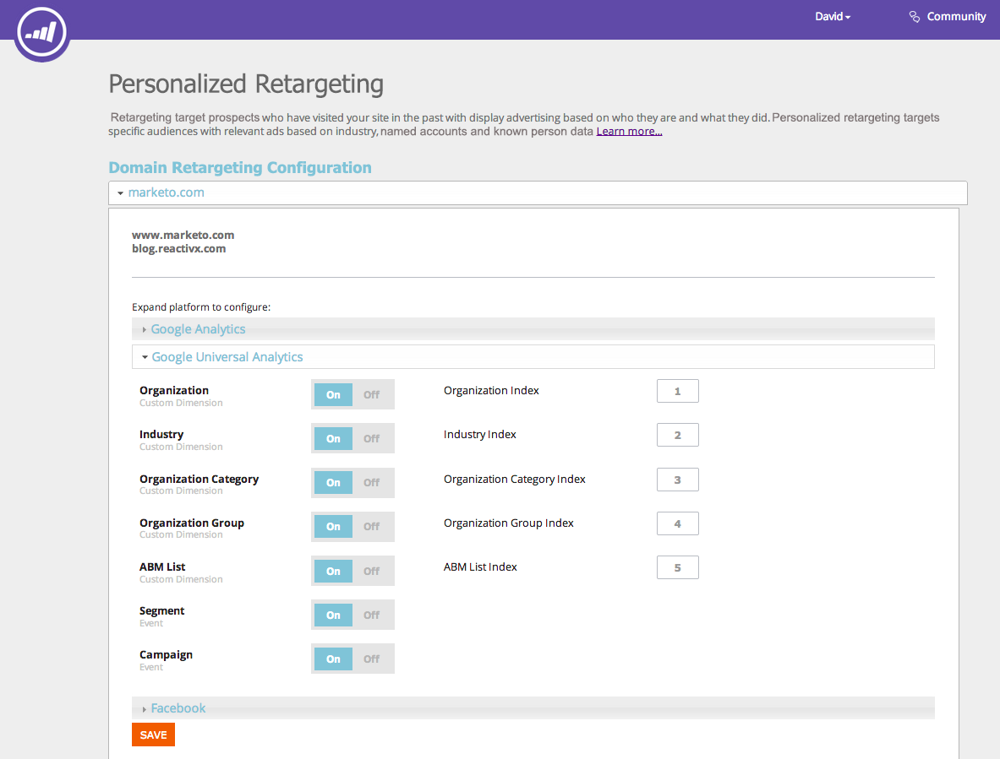

# Redirecionamento com dados de personalização da Web {#retargeting-with-web-personalization-data}

>[!AVAILABILITY]
>
>O Redirecionamento de site agora se enquadra no bloco Personalização da Web. Se você comprou apenas o Redirecionamento, verá esse bloco e acessará o produto de Personalização da Web com **somente** Recursos de redirecionamento habilitados. Isso dá acesso às configurações da conta, à página de redirecionamento, aos segmentos e às páginas de rastreamento adicionais.

O remarketing direciona os clientes potenciais que visitaram seu site no passado com publicidade de exibição com base em quem eles são e no que fizeram. O redirecionamento personalizado segmenta públicos-alvo específicos com anúncios relevantes com base no setor, contas nomeadas e dados de pessoas conhecidas.

A Personalização da Web atualmente anexa dados às seguintes plataformas de remarketing:

* [Google](/help/marketo/product-docs/web-personalization/website-retargeting/personalized-remarketing-in-google.md)
* [Facebook](/help/marketo/product-docs/web-personalization/website-retargeting/personalized-remarketing-in-facebook.md)

A Personalização da Web envia os seguintes dados para as plataformas de remarketing para criar públicos e executar campanhas de anúncios de remarketing:

<table> 
 <tbody> 
  <tr> 
   <th colspan="1">Dados de personalização da Web</th> 
  </tr> 
  <tr> 
   <th>
Setor
</th> 
  </tr> 
  <tr> 
   <th>
Grupo (Enterprise, SMB)
</th> 
  </tr> 
  <tr> 
   <th>
Categoria (Fortune 500/1000, Global 2000)
</th> 
  </tr> 
  <tr> 
   <th>
Lista ABM (listas de contas nomeadas)
</th> 
  </tr> 
  <tr> 
   <th>
Público segmentado (com base em segmentos)
</th> 
  </tr> 
  <tr> 
   <th>
Campanhas da Web clicadas
</th> 
  </tr> 
 </tbody> 
</table>

## Configuração de remarketing {#remarketing-configuration}

1. Ir para **Redirecionamento**.

   

   >[!NOTE]
   >
   >A configuração de redirecionamento é por domínio ou subdomínio. Ative os outros domínios se desejar enviar dados desses domínios para a plataforma de redirecionamento.

1. Ative as configurações do Google Analytics ou do Google Universal Analytics por domínio.

   >[!NOTE]
   >
   >Você precisa ter a Tag de redirecionamento do Google implementada em seu site.
   >
   >Se você já configurou a Integração com a personalização da Web e o Google Analytics, não é necessário editar esta parte, pois é a mesma configuração em Configurações da conta.

   

1. Ative a configuração para o Facebook. Clique e expanda a opção Facebook, Clique em **Ligado** para enviar os respectivos eventos e dados para o Facebook Audience Manager. Clique em **Salvar**.

   >[!NOTE]
   >
   >Você precisa ter [Pixel de público-alvo personalizado do facebook](https://developers.facebook.com/docs/ads-for-websites/website-custom-audiences/getting-started#install-the-pixel)o site foi instalado para que esse recurso funcione.

   

## Criação de público segmentado {#creating-segmented-audience}

Um público-alvo segmentado permite selecionar um segmento existente como um público-alvo para usar em campanhas de redirecionamento. Por exemplo, selecionando os segmentos Pessoa conhecida.

>[!TIP]
>
>Não há necessidade de criar um Público-alvo segmentado para dados do setor ou outros que já tenham sido enviados na Configuração de domínio. É melhor usar Públicos segmentados para segmentos com base em dados de pessoas conhecidas.

1. Clique em **Criar público segmentado**.

   

1. Insira o Nome do público-alvo, selecione Canais e selecione Segmento na lista de Segmentos existentes.

   

1. Clique em **Salvar**.

   Você concluiu a Configuração de redirecionamento na Personalização da Web, fez logon nas plataformas de redirecionamento e criou públicos-alvo com base nesses dados e configurou as campanhas de anúncios de redirecionamento.
