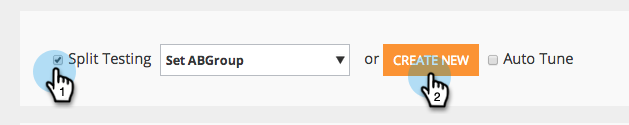
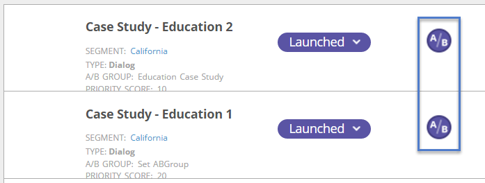

# AB Testar Sua Campanha Da Web {#ab-test-your-web-campaign}

Testar é uma ótima maneira de otimizar suas campanhas da Web para melhorar o engajamento. Veja como começar.

Para testar suas campanhas personalizadas com A/B, você pode selecionar duas ou mais campanhas, associá-las ao mesmo grupo de **[!UICONTROL Teste de Divisão]** e selecionar **[!UICONTROL Ajuste Automático]** para continuar automaticamente com a campanha com melhor desempenho.

>[!TIP]
>
>Se você preferir calcular manualmente e ver qual campanha está tendo melhor desempenho, não habilite o [!UICONTROL Ajuste automático].

## Como configurar um teste A/B de divisão {#how-to-set-up-a-split-a-b-test}

1. Vá para **[!UICONTROL Campanhas da Web]**.

   

   >[!NOTE]
   >
   >Para facilitar a localização da campanha desejada, use o [recurso de filtro](/help/marketo/product-docs/web-personalization/working-with-web-campaigns/filter-web-campaigns.md).

1. Selecione a primeira campanha que deseja fazer o teste A/B. Clique em **[!UICONTROL Editar]**.

   

1. Na página da campanha, selecione **[!UICONTROL Teste de Divisão]** e clique em **[!UICONTROL Criar Novo]**.

   

1. Insira o **Nome do Grupo de Teste de Divisão**, clique em **[!UICONTROL Criar]**. Selecione **[!UICONTROL Ajuste Automático]**.

   

1. **[!UICONTROL Salve]** ou **[!UICONTROL Inicie]** a campanha.

   >[!TIP]
   >
   >Selecionar **[!UICONTROL Ajuste Automático]** permite que a plataforma [!DNL Web Personalization] reconheça automaticamente a campanha de teste dividido com melhor desempenho e continue com a campanha de conversão mais alta enquanto pausa as outras.

1. Repita o processo acima com a segunda campanha.

1. Selecione a segunda campanha que deseja fazer o teste A/B. Clique em **[!UICONTROL Editar]**.

   

1. Na página **[!UICONTROL Definir campanha]**, selecione **Dividir teste** e escolha o **Grupo** no menu suspenso. Selecione **[!UICONTROL Ajuste Automático]**.

   

1. **[!UICONTROL Salve]** ou **[!UICONTROL Inicie]** a campanha.

1. Repita esse processo para uma terceira ou quarta campanha a ser testada.

1. Em **[!UICONTROL Campanhas da Web]**, você pode ver as campanhas de teste divididas indicadas pelo ícone A/B.

   

>[!TIP]
>
>1. Você pode testar quantas campanhas desejar. A prática recomendada é de duas a três campanhas
>1. Verifique se cada grupo de teste dividido está associado ao mesmo segmento. Você deseja testar na mesma audiência.
>1. Experimente diferentes partes de conteúdo (Estudo de caso A vs. Estudo de caso B), altere as mensagens e os elementos de criação, cores, tamanhos ou planos de ação.
>1. Otimize e aproveite seu conteúdo personalizado!

>[!MORELIKETHIS]
>
>* [Criar uma Campanha de Diálogo](/help/marketo/product-docs/web-personalization/working-with-web-campaigns/create-a-new-dialog-web-campaign.md)
>* [Criar um RTP na campanha de zona](/help/marketo/product-docs/web-personalization/working-with-web-campaigns/create-a-new-in-zone-web-campaign.md)
>* [Criar uma Campanha do Widget RTP](/help/marketo/product-docs/web-personalization/working-with-web-campaigns/create-a-new-widget-web-campaign.md)
