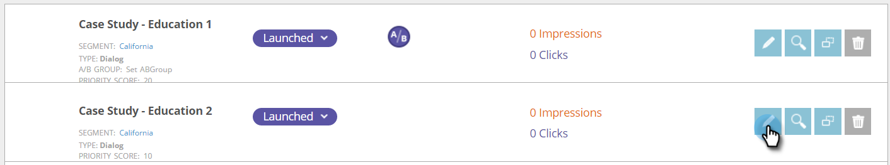

# Teste AB de sua campanha da Web {#ab-test-your-web-campaign}

Testar é uma ótima maneira de otimizar suas campanhas da Web para um melhor engajamento. Aqui está como começar.

Para testar suas campanhas personalizadas, é possível selecionar duas ou mais campanhas, associá-las à mesma **Teste de divisão** e selecione **Ajuste automático** para continuar automaticamente com a campanha com melhor desempenho.

>[!TIP]
>
>Se preferir calcular manualmente e ver qual campanha está tendo melhor desempenho, não ative Ajuste automático.

## Como configurar um teste A/B dividido {#how-to-set-up-a-split-a-b-test}

1. Acesse Campanhas da Web.

   

   >[!NOTE]
   >
   >Para facilitar a localização da campanha desejada, use o [recurso de filtro](/help/marketo/product-docs/web-personalization/working-with-web-campaigns/filter-web-campaigns.md).

1. Selecione a primeira campanha que deseja para o teste A/B. Clique em **Editar**.

   

1. Na página da campanha, selecione **Teste de divisão** e clique em **Criar novo**.

   

1. Insira o **Dividir Nome do Grupo de Teste**, clique em **Criar**. Selecionar **Ajuste automático**.

   

1. **Salvar** ou **Launch** a campanha.

   >[!TIP]
   >
   >Selecionar **Ajuste automático** O permite que a plataforma Web Personalization reconheça automaticamente a campanha de teste de divisão com melhor desempenho e continue com a maior campanha de conversão enquanto pausa as outras.

1. Repita o processo acima com a segunda campanha.

1. Selecione a segunda campanha que deseja para o teste A/B. Clique em **Editar**.

   

1. No **Definir campanha** página, selecione **Teste de divisão** e escolha a **Grupo** no menu suspenso . Selecionar **Ajuste automático**.

   

1. **Salvar** ou **Launch** a campanha.

1. Repita esse processo para uma terceira ou quarta campanha para testar.

1. Em **Campanhas da Web** é possível ver as campanhas de teste dividido indicadas pelo ícone A/B.

   

>[!TIP]
>
>1. Você pode testar quantas campanhas desejar. A prática recomendada é de duas a três campanhas
>1. Certifique-se de que cada grupo de teste de divisão esteja associado ao mesmo segmento. Você deseja testar para o mesmo público-alvo.
>1. Tente diferentes partes de conteúdo (Estudo de caso A vs. Estudo de caso B), altere as mensagens e os elementos criativos, as cores, os tamanhos ou chame para ações.
>1. Otimize e desfrute de seu conteúdo personalizado!

>[!MORELIKETHIS]
>
>* [Criar uma campanha de diálogo](/help/marketo/product-docs/web-personalization/working-with-web-campaigns/create-a-new-dialog-web-campaign.md)
>* [Criar uma Campanha RTP na Zona](/help/marketo/product-docs/web-personalization/working-with-web-campaigns/create-a-new-in-zone-web-campaign.md)
>* [Criar uma campanha de widget RTP](/help/marketo/product-docs/web-personalization/working-with-web-campaigns/create-a-new-widget-web-campaign.md)

