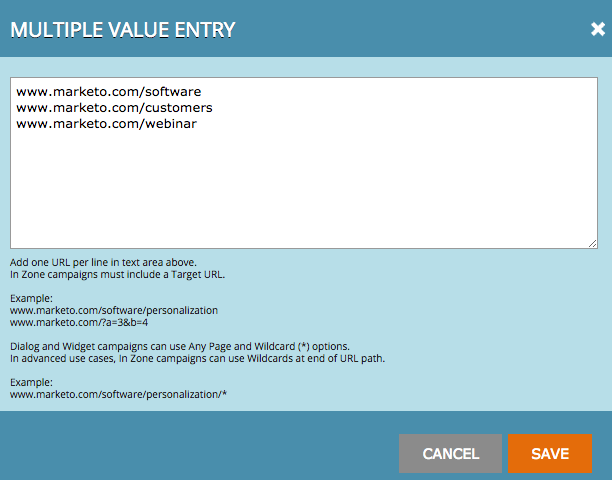

# Adicionar um URL de direcionamento a uma campanha da Web {#adding-a-target-url-to-a-web-campaign}

Um URL do Target está localizado na página Definir campanha e define o URL ou URLs específicos nos quais uma campanha da Web será exibida.

## Adicionar um URL de direcionamento para campanhas da Web de diálogo ou widget {#adding-a-target-url-for-dialog-or-widget-web-campaigns}

1. Vá para **Campanhas da Web**.

   

1. Selecione **Criar Nova Campanha Da Web**.

   

1. Adicione um **Nome da campanha**. Selecione um **Segmento de Destino**. Adicionar **URL de Destino**.

   

<table> 
 <thead> 
  <tr> 
   <th colspan="1" rowspan="1">Nome</th> 
   <th colspan="1" rowspan="1">Descrição</th> 
  </tr> 
 </thead> 
 <tbody> 
  <tr> 
   <td colspan="1" rowspan="1"><strong>Qualquer página</strong></td> 
   <td colspan="1" rowspan="1">
Permitir que a campanha apareça em qualquer página.
</td> 
  </tr> 
  <tr> 
   <td colspan="1" rowspan="1">
<strong>Incluir parâmetro da URL ao estabelecer a correspondência</strong>
</td> 
   <td colspan="1" rowspan="1">Adicione o parâmetro de URL para corresponder e mostrar a campanha nos URLs, incluindo este parâmetro. Ex. campaign=cpc</td> 
  </tr> 
 </tbody> 
</table>

## Adicionar vários URLs ao URL de direcionamento {#adding-multiple-urls-to-target-url}

Clicar no ícone de adição () abrirá a caixa de diálogo Entrada de Vários Valores para adicionar várias URLs. Adicione um URL por linha.

>[!NOTE]
>
>* As campanhas da Web de Widget e de caixa de diálogo podem usar as opções de Qualquer Página e Curinga (&#42;).
* Em casos de uso avançados, as campanhas da Web na região podem usar curingas no final do caminho do URL. Exemplo: [www.marketo.com/software/personalization/*](https://www.marketo.com/software/web-personalization/)
* O URL diferencia maiúsculas de minúsculas

## Adicionar um URL de direcionamento para campanhas da Web na zona {#adding-a-target-url-for-in-zone-web-campaigns}

1. Ir para **Web** **Campanhas**.

   

1. Selecione **Criar Nova Campanha Da Web**.

   

1. Adicione um **Nome da campanha**. Selecione um **Segmento de Destino**. Adicionar **URL de Destino**.

   >[!NOTE]
   >
   O URL de destino com regiões internas deve definir um ou mais URLs específicos. Em casos de uso avançados, as campanhas da Web na região podem usar curingas no final do caminho do URL. Exemplo: [www.marketo.com/software/personalization/*](https://www.marketo.com/software/web-personalization/)

   

>[!MORELIKETHIS]
>
* [Criar uma Campanha de Diálogo](/help/marketo/product-docs/web-personalization/working-with-web-campaigns/create-a-new-dialog-web-campaign.md)
* [Criar um RTP na campanha de zona](/help/marketo/product-docs/web-personalization/working-with-web-campaigns/create-a-new-in-zone-web-campaign.md)
* [Criar uma Campanha do Widget RTP](/help/marketo/product-docs/web-personalization/working-with-web-campaigns/create-a-new-widget-web-campaign.md)
