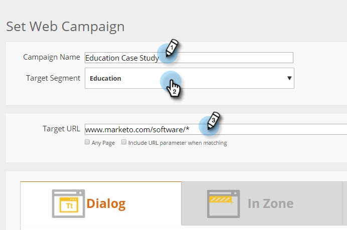

# Adicionando um URL de Público alvo a uma Campanha da Web {#adding-a-target-url-to-a-web-campaign}

Um URL de Público alvo está localizado na página Definir Campanha e define os URLs específicos nos quais uma campanha da Web será exibida.

## Adicionando um URL de Público alvo para o Dialog or Widget Web Campanha {#adding-a-target-url-for-dialog-or-widget-web-campaigns}

1. Vá para **Campanha**.

   

1. Selecione **Criar nova Campanha da Web**.

   

1. Adicione um **Nome da Campanha**. Selecione um **Segmento de Público alvo**. Adicione **URL do Público alvo**.

   

<table> 
 <thead> 
  <tr> 
   <th colspan="1" rowspan="1">Nome</th> 
   <th colspan="1" rowspan="1">Descrição</th> 
  </tr> 
 </thead> 
 <tbody> 
  <tr> 
   <td colspan="1" rowspan="1"><strong>Qualquer página</strong></td> 
   <td colspan="1" rowspan="1">
Permita que a campanha seja exibida em qualquer página.
</td> 
  </tr> 
  <tr> 
   <td colspan="1" rowspan="1">
<strong>Incluir parâmetro de URL ao corresponder</strong>
</td> 
   <td colspan="1" rowspan="1">Adicione um parâmetro de URL para corresponder e mostrar a campanha em URLs, incluindo esse parâmetro. Eg. campanha=cpc</td> 
  </tr> 
 </tbody> 
</table>

## Adicionar vários URLs ao URL do Público alvo {#adding-multiple-urls-to-target-url}

Clicar no ícone de adição () abrirá a caixa de diálogo Entrada de vários valores para adicionar vários URLs. Adicione um URL por linha.

>[!NOTE]
>
>* As campanhas da Web de caixa de diálogo e Widget podem usar as opções Qualquer página e Curinga (*).
* Em casos de uso avançado, nas campanhas da Web da Zona, é possível usar curingas no final do caminho do URL. Exemplo: [www.marketo.com/software/personalization/*](https://www.marketo.com/software/personalization/*)
* O URL faz distinção entre maiúsculas e minúsculas

## Adicionando um URL de Público alvo para o In Zone Web Campanha {#adding-a-target-url-for-in-zone-web-campaigns}

1. Vá para **Web** **Campanha**.

   

1. Selecione **Criar nova Campanha da Web**.

   

1. Adicione um **Nome da Campanha**. Selecione um **Segmento de Público alvo**. Adicione **URL do Público alvo**.

   >[!NOTE]
   O URL do público alvo com em zonas deve definir um URL ou URLs específicos. Em casos de uso avançado, nas campanhas da Web da Zona, é possível usar curingas no final do caminho do URL. Exemplo: [www.marketo.com/software/personalization/*](https://www.marketo.com/software/personalization/*)

   

>[!MORELIKETHIS]
* [Criar uma Campanha de diálogo](/help/marketo/product-docs/web-personalization/working-with-web-campaigns/create-a-new-dialog-web-campaign.md)
* [Criar uma Campanha RTP na zona](/help/marketo/product-docs/web-personalization/working-with-web-campaigns/create-a-new-in-zone-web-campaign.md)
* [Criar uma Campanha de widget RTP](/help/marketo/product-docs/web-personalization/working-with-web-campaigns/create-a-new-widget-web-campaign.md)

