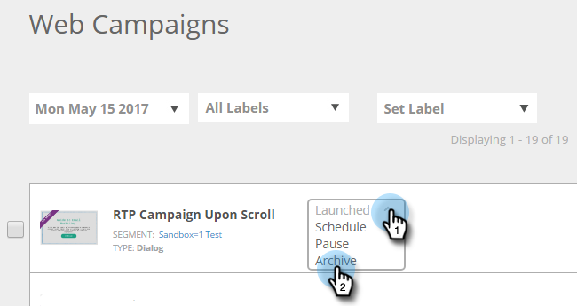

# Arquivar uma campanha da web {#archive-a-web-campaign}

1. Vá para **[!UICONTROL Campanhas da Web]**.

   

1. Clique na lista suspensa de status da campanha da Web desejada e selecione **[!UICONTROL Arquivar]**.

   

   >[!NOTE]
   >
   >As campanhas da Web arquivadas não serão exibidas no filtro padrão. Para vê-los, clique no ícone Filtro e, em **[!UICONTROL Status]**, marque a caixa de seleção **[!UICONTROL Arquivado]** e clique em **[!UICONTROL Aplicar]**.

>[!MORELIKETHIS]
>
>[Excluir uma [!UICONTROL Campanha da Web]](/help/marketo/product-docs/web-personalization/working-with-web-campaigns/delete-a-web-campaign.md)
