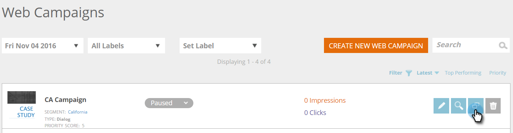

# Clonar uma campanha da Web {#clone-a-web-campaign}

Use o recurso de clonagem na página Campanhas da Web para copiar as configurações da campanha e alterar o conteúdo para otimizar o teste dividido ou clonar uma campanha com o mesmo conteúdo e direcioná-la para um segmento diferente. Crie campanhas da Web em segundos!

## Criar uma campanha de clonagem {#create-a-clone-campaign}

1. Vá para **Campanhas da Web**.

   

   >[!NOTE]
   >
   >Para facilitar a localização da campanha da Web desejada, use o [recurso de filtro](/help/marketo/product-docs/web-personalization/working-with-web-campaigns/filter-web-campaigns.md).

1. Para a campanha da Web, clique em **Clonar**.

   

1. O processo de clonagem de campanha copia todo o conteúdo da campanha da Web existente para a nova campanha clonada. A nova campanha da Web clonada é intitulada &quot;[NOME DA CAMPANHA] Copiar&quot;.

   

   >[!TIP]
   >
   >Todo o conteúdo da campanha da Web é copiado na campanha de clonagem, exceto o teste dividido. Portanto, não se esqueça de adicionar um grupo de teste dividido à campanha clonada se desejar testá-lo em relação a outros.

>[!MORELIKETHIS]
>
>* [Criar uma Campanha de Diálogo](/help/marketo/product-docs/web-personalization/working-with-web-campaigns/create-a-new-dialog-web-campaign.md)
>* [Criar um RTP na campanha de zona](/help/marketo/product-docs/web-personalization/working-with-web-campaigns/create-a-new-in-zone-web-campaign.md)
>* [Criar uma Campanha do Widget RTP](/help/marketo/product-docs/web-personalization/working-with-web-campaigns/create-a-new-widget-web-campaign.md)
