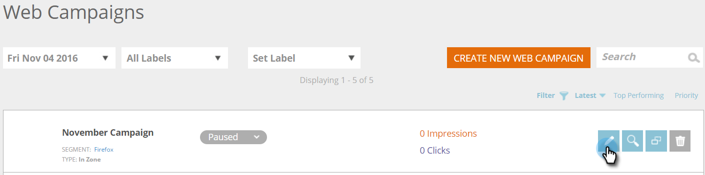

# Criar uma nova campanha da Web na zona {#create-a-new-in-zone-web-campaign}

Uma campanha da Web é uma reação personalizada associada a um segmento específico e pode ser uma [caixa de diálogo](/help/marketo/product-docs/web-personalization/working-with-web-campaigns/create-a-new-dialog-web-campaign.md) no seu site, uma substituição na zona, um [recurso de widget](/help/marketo/product-docs/web-personalization/working-with-web-campaigns/create-a-new-widget-web-campaign.md) ou um alerta por email. Uma campanha da Web Na Zona substitui um elemento do seu site com base na ID da Zona por conteúdo ou banners gráficos.

## Criar uma campanha da Web na zona {#create-an-in-zone-web-campaign}

1. Vá para **[!UICONTROL Campanhas da Web]**.

   

1. Selecione **[!UICONTROL Criar nova campanha da Web].**

   

1. Selecione o tipo de campanha **[!UICONTROL Na Zona]**. Personalize e adicione uma **[!UICONTROL ID da Zona].** Defina a campanha como **[!UICONTROL Fixa]** e adicione seu criativo no editor. Adicione a URL da página para visualizar e clique em **[!UICONTROL Visualizar]** para ver como a campanha reagirá no site.

   

   >[!NOTE]
   >
   >**O que é uma ID de Zona?**
   >
   >Uma ID de Zona é onde você deseja que sua campanha da Web &quot;[!UICONTROL Na Zona]&quot; esteja localizada no site. Para encontrar uma &quot;[!UICONTROL ID de Zona]&quot;, basta ir ao seu site e selecionar a área que deseja substituir por uma campanha da Web e clicar com o botão direito do mouse. No Chrome, a opção é &quot;Inspecionar elemento&quot;, em outros navegadores, ela pode variar.
   >
   >Em seguida, você deseja encontrar a &quot;id&quot; associada a esta seção do site, que é realçada porque você está inspecionando esse elemento. Por exemplo, se depois de clicar com o botão direito do mouse no Chrome, o texto realçado disser `
`, então &quot;feature-slider&quot; é o que você deve digitar na seção &quot;zone id&quot;. Normalmente, &quot;div id&quot; é usada, mas qualquer ID também pode ser usada, como h1 id, p id etc.

<table> 
 <thead> 
  <tr> 
   <th colspan="1" rowspan="1">Nome</th> 
   <th colspan="1" rowspan="1">Descrição</th> 
  </tr> 
 </thead> 
 <tbody> 
  <tr> 
   <td colspan="1" rowspan="1"><strong> ID da zona </strong></td> 
   <td colspan="1" rowspan="1">
Insira o nome da id encontrada no código HTML do elemento do site que a campanha substitui.
</td> 
  </tr> 
  <tr> 
   <td colspan="1" rowspan="1">
<strong> Fixo
 </strong>
</td> 
   <td colspan="1" rowspan="1">A caixa de seleção Fixo é marcada por padrão para a campanha Na zona e mantém a campanha Na zona em sua posição da ID da zona durante toda a sessão do visitante no site. É recomendável ter sempre uma Zona de entrada definida como Fixa.</td> 
  </tr> 
  <tr> 
   <td colspan="1" rowspan="1">
<strong> Em Desaparecimento</strong> 
</td> 
   <td colspan="1" rowspan="1">Marcar a caixa de seleção Efeito do uso e Desaparecer fornece um efeito de desvanecimento da área ID da zona no site. Se a Zona de entrada for um banner gráfico, a página será carregada primeiro e a campanha será ativada com um efeito de esmaecimento.</td> 
  </tr> 
  <tr> 
   <td colspan="1"><strong>Deslizamento</strong></td> 
   <td colspan="1">Marcar a caixa de seleção Usar efeito e a opção Deslizante fornece um deslizamento em efeito para a área ID da zona no site. Se a Zona de entrada for um banner gráfico, a página será carregada primeiro e a campanha será ativada com um efeito deslizante da esquerda para a direita.</td> 
  </tr> 
  <tr> 
   <td colspan="1"><strong> Editor de Rich Text  </strong></td> 
   <td colspan="1">O editor de rich text permite a formatação de texto, vinculação e inserção de imagem. <a href="/help/marketo/product-docs/web-personalization/working-with-web-campaigns/using-the-web-personalization-rich-text-editor.md">Leia mais aqui</a>.</td> 
  </tr> 
  <tr> 
   <td colspan="1"><strong> Visualizar no site   </strong></td> 
   <td colspan="1">Visualize campanhas antes que sejam iniciadas.   
    <ul> 
     <li> URL - Insira um URL de exemplo, no qual a campanha seria executada para ver um exemplo de visualização de como a campanha seria exibida.</li> 
     <li>Dispositivo - Visualize como sua campanha será exibida por dispositivo: Desktop, Retrato móvel, Paisagem móvel, Retrato de tablet, Paisagem de retrato.</li> 
     <li> Visualizar - Clique em <strong>Visualizar</strong> para abrir uma nova janela da URL de exemplo para ver como a campanha reage.</li> 
     <li> Compartilhar - Use o botão Compartilhar para enviar um email a um colega com um link para ver a campanha de proxy.</li> 
    </ul></td> 
  </tr> 
 </tbody> 
</table>

>[!TIP]
>
>Acelere e simplifique o processo de criação de campanha usando os nossos [modelos integrados](/help/marketo/product-docs/web-personalization/using-templates/using-templates-to-create-web-campaigns.md) ou [salvando a campanha existente](/help/marketo/product-docs/web-personalization/using-templates/using-templates-to-create-web-campaigns.md) como modelo para reutilização.

>[!NOTE]
>
>**Deseja Testar A/B suas campanhas da Web?** Uma ou mais campanhas da Web podem ser [testadas A/B para obter os melhores resultados](/help/marketo/product-docs/web-personalization/working-with-web-campaigns/ab-test-your-web-campaign.md). Com o recurso de Ajuste automático, a plataforma reconhece automaticamente as campanhas com melhor desempenho, continua com as campanhas de conversão mais altas e pausa as outras.

## Editar uma campanha da Web {#edit-a-web-campaign}

Na página **Campanhas da Web**, clique em **Editar** na campanha.

>[!NOTE]
>
>Para facilitar a localização da campanha desejada, use o [recurso de filtro](/help/marketo/product-docs/web-personalization/working-with-web-campaigns/filter-web-campaigns.md).

## Pré-visualizar uma campanha da Web {#preview-a-web-campaign}

1. Na página [!UICONTROL Campanhas da Web], clique em **[!UICONTROL Visualizar]** na campanha da Web que deseja exibir.

   

## Clonar uma campanha da Web {#clone-a-web-campaign}

Consulte [Clonar uma campanha da Web](/help/marketo/product-docs/web-personalization/working-with-web-campaigns/clone-a-web-campaign.md).

## Excluir uma campanha da Web {#delete-a-web-campaign}

1. Na página Campanhas da Web, clique em **[!UICONTROL Excluir]** na campanha que deseja excluir.

   

1. Uma mensagem de confirmação é exibida para confirmar se você deseja excluir a Campanha.

>[!MORELIKETHIS]
>
>* [Criar uma Nova Campanha Web do Widget](/help/marketo/product-docs/web-personalization/working-with-web-campaigns/create-a-new-widget-web-campaign.md)
>* [Criar uma Nova Campanha da Web de Caixa de Diálogo](/help/marketo/product-docs/web-personalization/working-with-web-campaigns/create-a-new-dialog-web-campaign.md)
