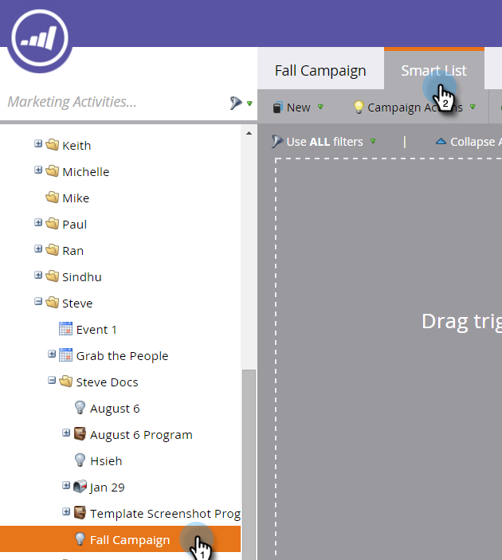
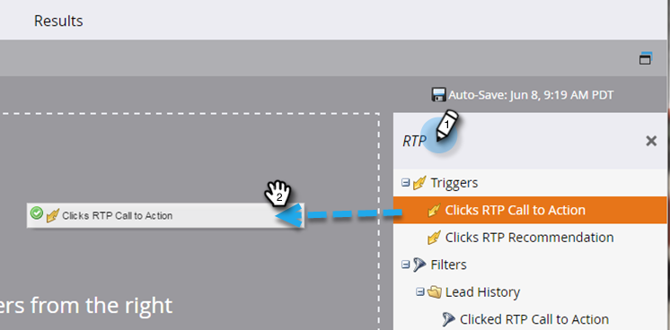
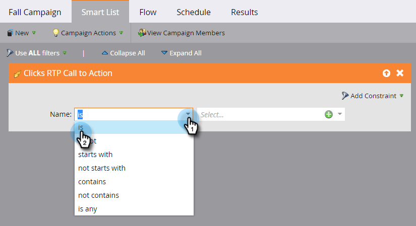
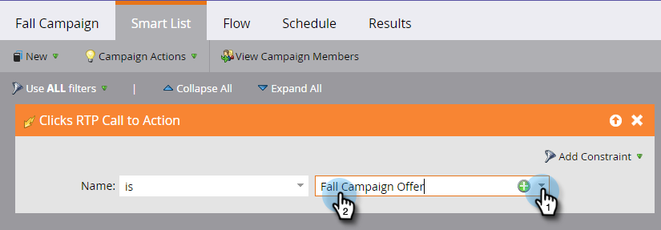
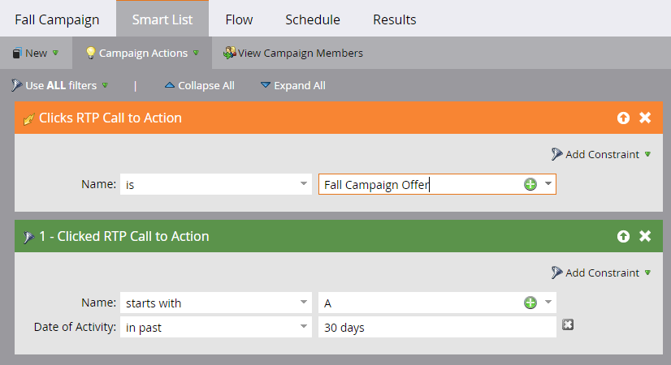

# Definir uma lista inteligente para atividades do [!DNL Web Personalization] {#define-a-smart-list-for-web-personalization-activities}

Você pode usar [!DNL Web Personalization] atividades em filtros e acionadores ao definir uma lista inteligente em uma campanha inteligente. Aqui, você deseja capturar qualquer pessoa que clicou em um [!DNL Web Personalization] call to action (campanha).

Use um acionador para enviar um email ou alerta, ou alterar um valor ou uma pontuação com base nos visitantes que clicaram e se envolveram com uma call to action [!DNL Web Personalization]. Você também pode filtrar e visualizar os clientes em potencial que clicaram em um call to action [!DNL Web Personalization].

1. Na sua campanha inteligente, clique na guia **[!UICONTROL Smart List]**.

   

   >[!NOTE]
   >
   >As Smart Lists podem fazer coisas incríveis. Saiba mais na [Análise detalhada de lista inteligente](/help/marketo/product-docs/core-marketo-concepts/smart-campaigns/understanding-smart-campaigns.md).

1. Procure o acionador e arraste-o e solte-o na tela.

   

   >[!NOTE]
   >
   >Uma campanha inteligente com acionadores é executada no modo Acionador. Ele é executado em uma pessoa por vez com base nos eventos acionados e nos filtros adicionados.

1. Clique na lista suspensa e escolha um operador.

   

   >[!CAUTION]
   >
   >Linhas vermelhas sinuosas indicam um erro. Se não for corrigida, a campanha será inválida e não será executada.

1. Defina o acionador.

   

1. Adicione filtros conforme necessário.

   

   >[!TIP]
   >
   >Em uma campanha inteligente com acionadores e filtros, os acionadores ficam no topo. Quando acionado, somente as pessoas que atendem aos critérios de filtro passarão pelo fluxo.

   >[!NOTE]
   >
   >Com vários acionadores, uma pessoa passa para o fluxo se QUALQUER um dos acionadores for ativado.

   Para executar a campanha em um conjunto de pessoas ao mesmo tempo, saiba como [Definir a lista inteligente para a campanha inteligente | Lote](/help/marketo/product-docs/core-marketo-concepts/smart-campaigns/creating-a-smart-campaign/define-smart-list-for-smart-campaign-batch.md).

   >[!MORELIKETHIS]
   >
   >* [Definir lista inteligente para campanha inteligente | Lote](/help/marketo/product-docs/core-marketo-concepts/smart-campaigns/creating-a-smart-campaign/define-smart-list-for-smart-campaign-batch.md)
   >* [Adicionar uma Etapa de Fluxo a uma Campanha Inteligente](/help/marketo/product-docs/core-marketo-concepts/smart-campaigns/flow-actions/add-a-flow-step-to-a-smart-campaign.md)
   >* [Definir uma lista inteligente para atividades de conteúdo preditivo](/help/marketo/product-docs/predictive-content/define-a-smart-list-for-predictive-content-activities.md)
