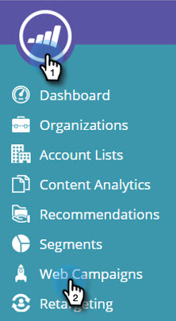

# Editar uma campanha da web existente {#edit-an-existing-web-campaign}

1. Vá para **[!UICONTROL Campanhas da Web]**.

   

1. Na página **[!UICONTROL Campanhas da Web]**, clique em **[!UICONTROL Editar]** na campanha que deseja editar.

   

   >[!NOTE]
   >
   >Para facilitar a localização da campanha da Web desejada, use o [recurso de filtro](/help/marketo/product-docs/web-personalization/working-with-web-campaigns/filter-web-campaigns.md).

>[!MORELIKETHIS]
>
>* [Excluir uma Campanha da Web](/help/marketo/product-docs/web-personalization/working-with-web-campaigns/delete-a-web-campaign.md)
>* [Iniciar/Pausar uma campanha](/help/marketo/product-docs/web-personalization/working-with-web-campaigns/launch-pause-a-web-campaign.md).
