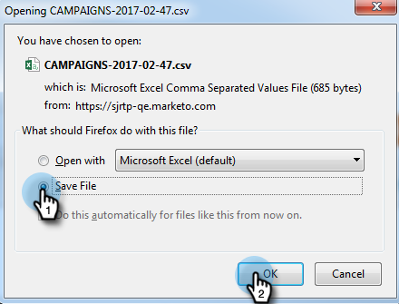

# Exportar dados da campanha da web {#export-web-campaign-data}

Siga estas etapas simples para exportar seus dados de campanha da Web.

1. Vá para **[!UICONTROL Campanhas da Web]**.

   

1. No canto superior direito da página, clique no ícone Exportar CSV.

   

1. Abra ou Salve o arquivo.

   

1. Visualize seu arquivo para ver estatísticas úteis.

   
