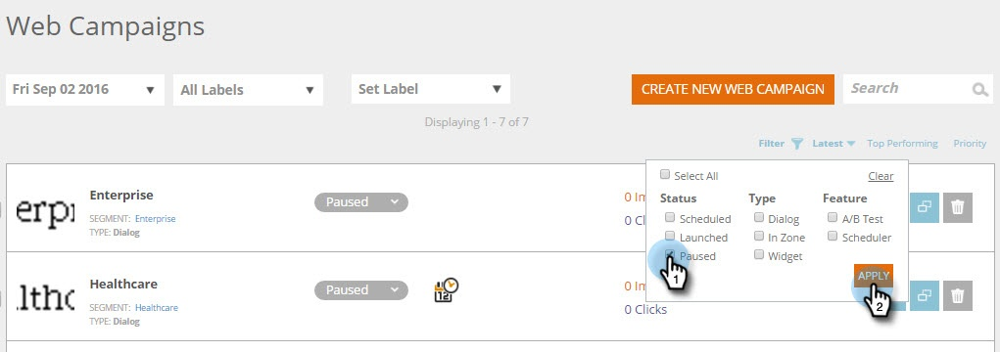

# Filtrar campanhas da web {#filter-web-campaigns}

Depois de criar centenas de campanhas de [!DNL Web Personalization], é muito útil poder usar filtros para exibir apenas aquelas em que você está interessado.

1. Vá para **[!UICONTROL Campanhas da Web]**.

   

1. Na página [!UICONTROL Campanhas da Web], clique em **[!UICONTROL Filtro]**.

   

1. Marque a caixa de seleção do Status e/ou Tipo de campanha que deseja filtrar, por exemplo, **[!UICONTROL Pausado]** ou **[!UICONTROL Caixa de diálogo]**. Clique em **[!UICONTROL Aplicar]**.

   

   >[!TIP]
   >
   >Use a caixa de seleção **[!UICONTROL Marcar tudo]** para escolher tudo ou o link **[!UICONTROL Limpar]** para desmarcar todas as caixas de seleção.

1. Agora, somente as campanhas que correspondem ao filtro são exibidas.

   

   Pedaço de bolo!
