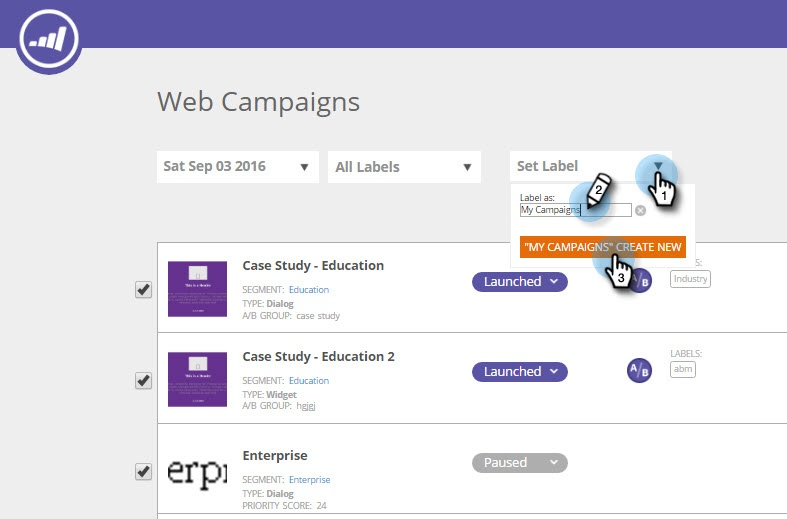

# Rotular as campanhas da Web {#label-your-web-campaigns}

Você tem tantas campanhas que a rolagem está se tornando complicada? Use rótulos para marcar suas campanhas, para que você possa classificá-las e encontrá-las rapidamente.

## Adicionar um rótulo a uma campanha da Web {#add-a-label-to-a-web-campaign}

1. Faça logon no Web Personalization e acesse a área Campanhas da Web.

   

   >[!NOTE]
   >
   >Para facilitar a localização da campanha desejada, use o [recurso de filtro](/help/marketo/product-docs/web-personalization/working-with-web-campaigns/filter-web-campaigns.md).

1. Selecione as campanhas que deseja marcar com um rótulo.

   

1. Insira o nome do rótulo desejado e clique em Create New.

   >[!TIP]
   >
   >Se o rótulo já existir, selecione-o e não crie um novo.

   

Legal! Agora você sabe como criar rótulos e atribuí-los a campanhas.

## Filtrar por rótulos existentes {#filter-by-existing-labels}

1. No menu suspenso de rótulos, selecione o rótulo que deseja usar como filtro.

   

1. Agora, mostramos apenas as campanhas associadas ao rótulo selecionado.

   

>[!MORELIKETHIS]
>
>[Rotular um segmento](/help/marketo/product-docs/web-personalization/using-web-segments/label-your-segment.md)
