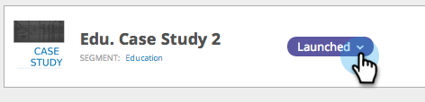

# Iniciar/pausar uma Campanha da Web {#launch-pause-a-web-campaign}

Uma campanha da Web é uma reação personalizada associada a um segmento específico e pode ser uma [caixa de diálogo](create-a-new-dialog-web-campaign.md) em seu site, uma [substituição de zona](create-a-new-in-zone-web-campaign.md), um recurso de widget ou um alerta de email.

Você pode iniciar ou pausar uma campanha da Web de duas formas na página Campanhas da Web ou na página Definir Campanhas da Web.

1. Clique em **Personalização da Web**.

   

1. Vá para **Campanha**.

   

1. Se a campanha for iniciada, clique em **Iniciada** para alterar o status da campanha para **Pausada, **para pausar a campanha.

   

1. Se a campanha estiver pausada, clique em **Pausada** para alterar o status da campanha para **Iniciada**. Isso ativará e iniciará a campanha.

   

   >[!NOTE]
   >
   >Você também pode alterar o status da campanha em Definir página de Campanha.

1. Na campanha, clique em **Editar**.

   

1. Clique em **Salvar** para salvar e pausar a campanha. Clique em **Iniciar** para iniciar e ativar a campanha.

   

>[!MORELIKETHIS]
>
>* [Criar uma nova Campanha da Web de diálogo](create-a-new-dialog-web-campaign.md)
>* [Criar uma nova Campanha da Web na zona](create-a-new-in-zone-web-campaign.md)
>* [Criar uma Campanha da Web de Widget](create-a-new-widget-web-campaign.md)

>

