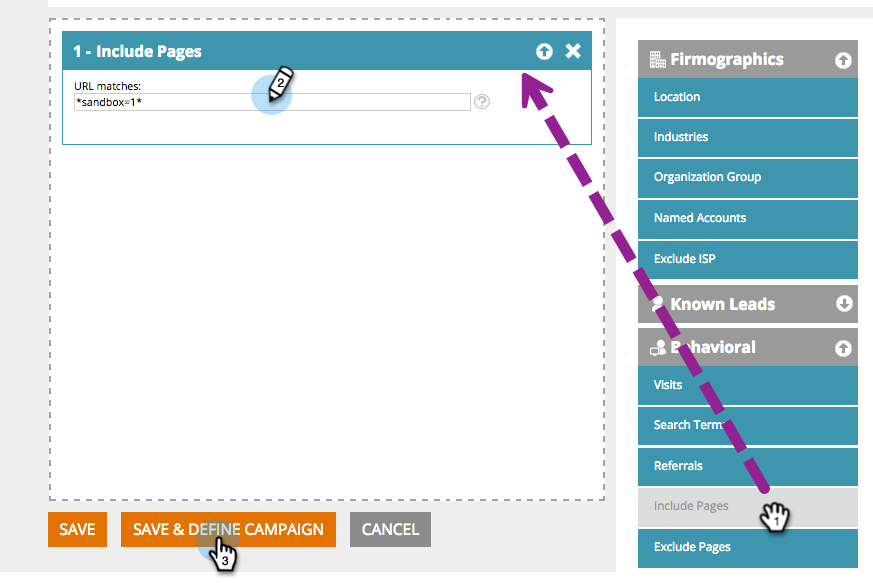

# Visualizar e testar uma campanha da Web {#preview-and-test-a-web-campaign}

Este artigo mostra diferentes maneiras de visualizar uma campanha da Web e também como testá-la usando um segmento de sandbox ao vivo em seu site.

>[!NOTE]
>
>A visualização mostra apenas como a campanha ficará no site escolhido. Links e widgets não funcionarão como para evitar cliques/exibições erradas na análise.

## Visualizar uma campanha da Web na página de criação {#preview-a-web-campaign-on-the-creation-page}

1. Ir para **Campanhas da Web**.

   

1. Clique em **Criar Nova Campanha da Web** ou o ícone para editar uma campanha existente.

   

1. Em Visualizar no site, adicione o URL da página e clique em **Visualizar**. Uma nova janela/guia é aberta mostrando a visualização da campanha.

   

   >[!TIP]
   >
   >Clique em **Compartilhar** para abrir um email com um URL fixo da visualização da campanha.

   >[!NOTE]
   >
   >Você também tem a opção de instalar um plug-in do navegador (ou [Cromo](https://chrome.google.com/webstore/detail/marketo-web-personalizati/ldiddonjplchallbngbccbfdfeldohkj) ou [Firefox](https://rtp-static.marketo.com/rtp/libs/mwp-0.0.0.8.xpi)) para obter a melhor experiência em visualizar sua campanha. Consulte a seção abaixo.

## Visualizar uma campanha da Web na página de criação usando o plug-in do navegador {#preview-a-web-campaign-on-the-creation-page-using-the-browser-plug-in}

1. Siga as etapas 1 e 2 da seção acima.

1. Clique no link para o plug-in do navegador (neste caso, estamos usando o Chrome).

   

1. Uma nova janela/guia é aberta. Clique em **Adicionar ao Chrome**.

   

1. Clique em **Adicionar extensão**.

   

1. Volte para o Marketo. Adicione o URL da página e clique em **Visualizar**.

   

1. Uma nova janela/guia é aberta, permitindo que você visualize a aparência da campanha em um desktop, telefone ou tablet.

   

## Visualizar uma campanha da Web na página de campanhas da Web {#preview-a-web-campaign-on-the-web-campaigns-page}

1. Ao analisar a lista de suas campanhas da Web, basta escolher uma campanha e clicar no botão **Visualizar** ícone .

   

   Fácil!

## Visualizar uma campanha da Web no seu site {#preview-a-web-campaign-on-your-website}

Crie um segmento e uma campanha sandbox.

1. Ir para **Segmentos**.

   

1. Clique em **Criar novo**.

   

1. Nomeie o segmento.

1. Em Comportamento, arraste Incluir páginas para a tela. Adicione o valor &#42;sandbox=1&#42;. Clique em **Salvar e definir campanha**.

   

1. Na página Definir campanha da Web, altere o segmento do Target para o segmento da sandbox, selecionando-o na lista.

   

1. Complete o anúncio da campanha e clique em **Launch**.

   

1. Vá para o site e adicione o parâmetro de URL &quot;?sandbox=1&quot; ao final do URL. Exemplo: `www.marketo.com?sandbox=1`.

1. Veja a reação da campanha em seu site.

>[!NOTE]
>
>As campanhas reagem apenas uma vez durante uma sessão de visitante. Para visualizar a campanha novamente, limpe os cookies do navegador.

>[!NOTE]
>
>Campanhas de redirecionamento não podem ser visualizadas. A única maneira de testá-los é usando um segmento de sandbox (direcionado por páginas específicas). &#42;sandbox=redirecionar&#42;)
